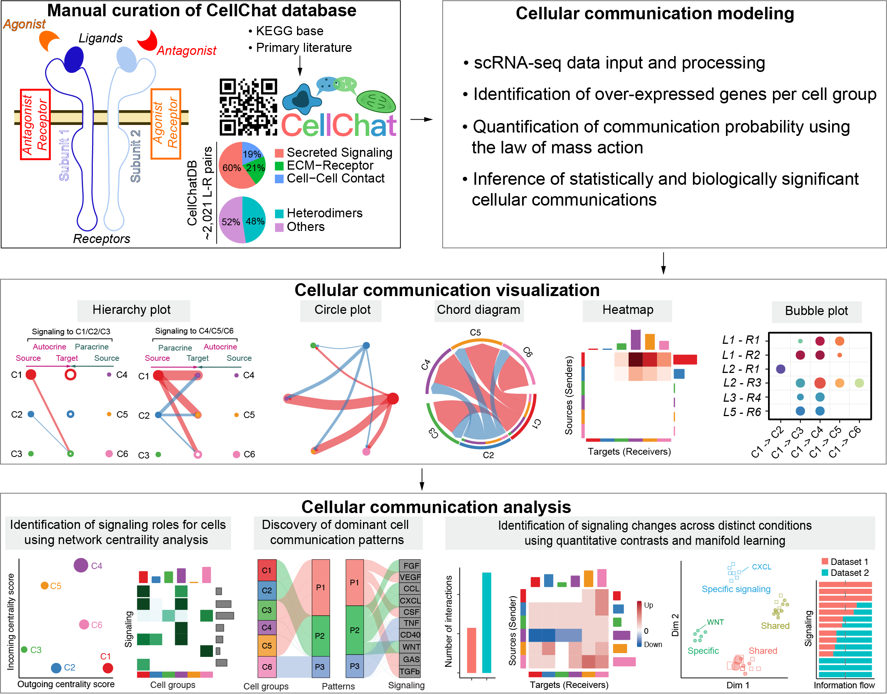

# 🧫 Aprendiendo CellChat

## 👋 Introducción
Recientemente, el uso de **datos de transcriptómica de célula única (scRNA-seq)** ha cambiado por completo la forma en la que estudiamos los sistemas biológicos. Hoy en día no solo podemos caracterizar distintos tipos celulares dentro de un tejido, sino también explorar cómo varían entre condiciones. Sin embargo, hay una pregunta igual de importante que muchas veces queda sin responder: **¿cómo se comunican estas células entre sí?**

Aquí es donde entra **CellChat**, una herramienta desarrollada en **R** que permite inferir y analizar la comunicación célula-célula a partir de datos de scRNA-seq. 

## 🧠 ¿Qué es CellChat?
CellChat es un **modelo computacional** que intenta **reconstruir la comunicación célula-célula** a partir de **datos de expresión génica**. Conceptualmente, se basa en que las células se comunican principalmente mediante **interacciones ligando-receptor**, donde una célula secreta una molécula (ligando) que activa un receptor en otra célula.

Es importante mencionar que CellChat no observa directamente esa comunicación, sino que la **infiere**. Es decir, si detecta que una célula expresa un ligando y otra expresa el receptor correspondiente, entonces estima que **podría existir comunicación entre ellas**.

### Descripción general de CellChat

Esta imagen muestra de forma simplificada cómo funciona CellChat para estudiar la comunicación celular.

En la parte superior izquierda se presenta la base de datos **CellChatDB**, la cual contiene interacciones conocidas entre ligandos y receptores. Esta base incluye distintos tipos de señalización, como señales secretadas, interacciones con la matriz extracelular y contacto célula-célula, además de considerar complejos moleculares y cofactores que regulan estas interacciones.

En la parte superior derecha se describe el **proceso de modelado**. A partir de datos de scRNA-seq, CellChat identifica genes sobreexpresados en cada grupo celular y utiliza esta información para estimar la probabilidad de comunicación celular, basándose en principios como la ley de acción de masas. Con ello, infiere qué interacciones son relevantes.

La sección central está dedicada a la **visualización de los resultados**. Se muestran distintos tipos de gráficos, como diagramas jerárquicos, redes circulares, diagramas de cuerdas, mapas de calor y gráficos de burbujas. Estas representaciones permiten observar de manera intuitiva qué tipos celulares interactúan entre sí, así como la intensidad y dirección de esas interacciones

Finalmente, en la parte inferior se presenta **el análisis de las redes de comunicación**. Aquí se identifican los roles de cada tipo celular (por ejemplo, emisores o receptores principales), se detectan patrones dominantes de comunicación y se comparan cambios en la señalización entre diferentes condiciones biológicas.

**Fuente:** Repositorio oficial de CellChat (Jin et al., 2021).

## 🎯 ¿Para qué sirve?
Se usa para responder preguntas como:
- ¿Qué células están interactuando entre sí?
- ¿Quién envía señales y quién las recibe?
- ¿Qué vías de señalización están activas?
- ¿Cómo cambia la comunicación entre condiciones (ej. sano vs enfermedad)?

Básicamente, ayuda a entender **el comportamiento colectivo de las células dentro de un tejido**.

## ⚙️ Flujo de trabajo

La metodología a grosso modo es la siguiente:

1. **Preparación de los datos:** Se introduce la matriz de expresión y la anotación de los tipos celulares, así como CellChatDB
2. **Creación del objeto CellChat:** Convierte los datos en un objeto CellChat.
3. **Identificación de genes e interacciones relevantes:** Detecta ligandos y receptores sobreexpresados.
4. **Inferencia de la red de comunicación:** Calcula qué células podrían estar interactuando y con qué intensidad.
5. **Análisis de la red:** Identifica células emisoras y receptoras, explora la centralidad y encuentra patrones.
6. **Visualización de los resultados:** Elabora gráficos de red para interpretar los datos.

Todo esto se hace con funciones en R, pero lo importante es entender qué representa cada paso.

## 📊 Aplicaciones, ventajas y desventajas

CellChat se puede usar para investigar una gran variedad de temas, aquí te dejo algunos ejemplos:
- **Envejecimiento:** Ver cómo cambia la comunicación celular con la edad.
- **Cáncer:** Analizar cómo las células tumorales interactúan con el microambiente.
- **Sistema inmune:** Estudiar la señalización entre células inmunes.
- **Desarrollo:** Entender cómo las células coordinan la formación de tejidos.

Mediante esta herramienta puedes llevar a cabo muchos análisis, sin embargo, es importante tomar en consideración lo siguiente:

| Aspecto | Ventajas | Desventajas |
|-----------|-----------|-----------|
| **Base biológica** | Integra conocimiento curado de interacciones ligando-receptor. | Depende completamente de bases de datos existentes; no detecta interacciones nuevas o no reportadas.        |
| **Tipo de análisis** | Permite estudiar la comunicación célula-célula, sumando otra aplicación al scRNA-seq. | Infiere indirectamente la comunicación celular a partir de expresión génica. |
| **Modelo matemático** | Usa un enfoque basado en *principios de acción de masas*, sencillo y computacionalmente eficiente. | Es una simplificación: no considera afinidad molecular, cinética, ni regulación.
| **Interpretación biológica** | Facilita entender roles celulares (emisores, receptores, mediadores) dentro de un sistema. | Puede sobreinterpretarse: una “interacción fuerte” no implica necesariamente relevancia biológica real.
| **Análisis de redes** | Aplica la *teoría de grafos* para identificar células esenciales y patrones globales de comunicación. | La interpretación de métricas de red puede ser compleja. |
| **Comparación entre condiciones** | Permite comparar redes entre estados (ej. sano vs enfermo). | No modela adecuadamente la variabilidad entre réplicas biológicas, lo que limita la robustez estadística.
| **Reducción de complejidad** | Resume miles de genes en redes y vías de señalización desglosables. | Esta reducción puede ocultar detalles importantes o generar pérdida de información. |
| **Visualización** | Ofrece múltiples herramientas gráficas (circle plots, bubble plots, etc.) que facilitan el análisis. | Algunas visualizaciones pueden ser difíciles de deducir. |
| **Usos** | Ampliamente útil en campos como cáncer, envejecimiento, inmunología y desarrollo. | Los resultados deben validarse experimentalmente.
| **Nivel de datos** | Funciona bien con datos de scRNA-seq ampliamente disponibles. | No considera directamente información espacial ni proteómica (a menos que se integre externamente).
| **Facilidad de uso** | Tiene un flujo de trabajo organizado y documentación disponible. | Puede presentar errores técnicos y una curva de aprendizaje considerable. | 

## 🧾 Conclusión

En resumidas cuentas, **CellChat** es una herramienta que te ayuda a ver a **las células** no como entidades aisladas, sino como **un sistema que se comunica constantemente**. Eso es justo lo que la hace tan valiosa: te permite interpretar tus datos desde una perspectiva más funcional y cercana a lo que realmente ocurre en un tejido.

Pero también hay que usarla con criterio. Lo que obtienes no son interacciones reales comprobadas, sino **posibles escenarios de comunicación basados en la expresión génica**. Por eso, es un excelente punto de partida para generar ideas y preguntas interesantes.

## 🤓 Hora de practicar

La mejor manera de consolidar los conocimientos aprendidos es aplicándolos. Por ello, en el siguiente tutorial [*Análisis de comunicación célula-célula con CellChat en R*](https://github.com/aylindmm/Tutoriales/tree/main/scRNA-seq/CellChat/Tutorial) realizaremos un ejercicio práctico paso a paso, basado en el material original, donde podrás ejecutar cada comando, explorar las salidas y reforzar lo aprendido en este apartado.

## Bibliografía
 *Jin, S., Guerrero-Juarez, C. F., Zhang, L., Chang, I., Ramos, R., Kuan, C., Myung, P., Plikus, M. V., & Nie, Q. (2021). Inference and analysis of cell-cell communication using CellChat. Nature Communications, 12(1), 1088. https://doi.org/10.1038/s41467-021-21246-9*

 *Jin, S., Plikus, M. V., & Nie, Q. (2025). CellChat for systematic analysis of cell-cell communication from single-cell transcriptomics. Nature protocols, 20(1), 180–219. https://doi.org/10.1038/s41596-024-01045-4*

*Shao, X., Lu, X., Liao, J., Chen, H., & Fan, X. (2020). New avenues for systematically inferring cell-cell communication: through single-cell transcriptomics data. Protein & Cell, 11(12), 866-880. https://doi.org/10.1007/s13238-020-00727-5*
