# 💻 Análisis de comunicación celular con CellChat en R

A continuación, aplicaremos **CellChat** paso a paso para analizar la comunicación célula-célula a partir de datos de secuenciación de RNA de célula única (scRNA-seq), siguiendo un flujo de trabajo completo en **R**. Se trabajará directamente con las funciones de la herramienta para construir e interpretar redes de comunicación intercelular.

Esta guía está basada en el material original desarrollado por los autores de CellChat y disponible en su [repositorio oficial de GitHub](https://github.com/sqjin/CellChat
). Nuestro objetivo no es reemplazarlo, sino adaptarlo, traducirlo y explicarlo de una manera más accesible. Se busca que se comprenda qué está pasando en cada etapa del análisis, para que después puedas poner en práctica estos conocimientos en tus propios proyectos y no solo reproducir un flujo de trabajo.

## 🔧 Antes de empezar
Inicialmente es importante cumplir con algunos requisitos básicos para asegurar que el flujo de trabajo funcione correctamente:

1. Contar con conocimientos básicos de R y análisis de scRNA-seq.
2. Se requiere un objeto de scRNA-seq previamente procesado. 

>Es vital tener la anotación de tipos celulares, puesto que CellChat utiliza estas etiquetas para inferir la comunicación entre los grupos.

## ⚙️ Parte 1. Instalación de CellChat
Para comenzar, es primordial instalar CellChat y algunas dependencias en R. Dado que CellChat no siempre está disponible directamente en CRAN (*Comprehensive R Archive Network*, ecosistema central de R que alberga decenas de miles de paquetes), se instala desde GitHub.

Primero, asegúrate de tener instalado el paquete devtools (o remotes), que permite instalar paquetes desde GitHub.
```
install.packages("devtools")
library(devtools)
```
Luego, puedes instalar CellChat con el siguiente comando:
```
devtools::install_github("jinworks/CellChat")
```
Durante la instalación, es posible que se instalen automáticamente varias dependencias, por lo que es posible que tarde un rato.

Si ocurre algún error, verifica que tengas actualizadas tus versiones de R y de los paquetes requeridos.

### 1.1  Cargar librerías
Una vez instalado, llama a `CellChat` junto con otros paquetes necesarios:

 - `patchwork`: Se emplea para combinar gráficos ggplot en una sola figura.
 - `Cellchat`: Permite usar todas sus funciones para explorar la comunicación celular en datos de scRNA-seq.
 - `stringsAsFactors = FALSE`: Evita que texto se convierta automáticamente en un factor.

```
library(CellChat)
library(patchwork)
options(stringsAsFactors = FALSE)
```
## 📂 Parte 2. Input y preparación de los datos

Para este tutorial se utilizarán un conjunto de datos de scRNA-seq que ya ha sido procesado y anotado. Este *dataset* combina información sobre piel humana en 2 condiciones biológicas: LS (*skin lesion*, piel lesionada) y NL (*normal skin*, piel normal).

En el tutorial original, estos datos se proporcionan como un objeto Seurat llamado `data_humanSkin`, el cual contiene la matriz de expresión génica y la anotación de tipos celulares, que son los 2 archivos que Cellchat necesita para trabajar.

### 2.1 Cargar los datos 

Se empieza cargando el objeto `data_humanSkin` en el entorno de R. Para ello:

1. Descarga el archivo [data_humanSkin_CellChat.rda](https://ndownloader.figshare.com/files/25950872).
2. Ve al panel **Files**.
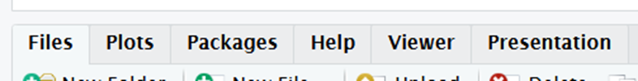
3. Haz clic en **Upload**.

4. Selecciona el archivo previamente descargado y haz clic en **OK**.
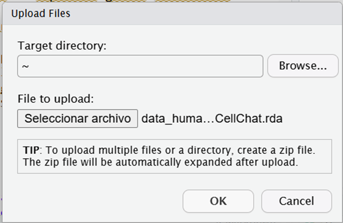
5. Cuando lo encuentres en el panel **Files**, haz clic en el **archivo**.
6. Luego te aparecerá la siguiente ventana, haz clic en **Yes**.
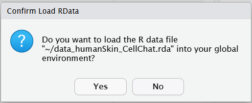

Otra opción es utilizar la ruta completa de acceso al archivo:

```
load("/ruta/completa/a/data_humanSkin_CellChat.rda")
```
📤 **Salida esperada:** El objeto `data_humanSkin` se encuentra disponible en el entorno de trabajo. El cual incluye: 
- Una matriz de expresión génica (`data`).
- Un *data frame* (tabla) con los metadatos (`meta`).

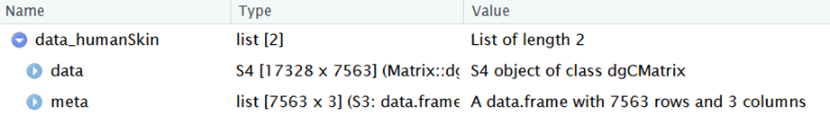

#### 2.1.1 Extraer la matriz de expresión y los metadatos

Aquí se separan los dos componentes principales:
- `data.input`: matriz de expresión.
- `meta`: información de cada célula (tipo celular, condición, etc.)

```
data.input = data_humanSkin$data
meta = data_humanSkin$meta
```

📤 **Salida esperada:** Dos objetos listos para manipular.

- `data.input`
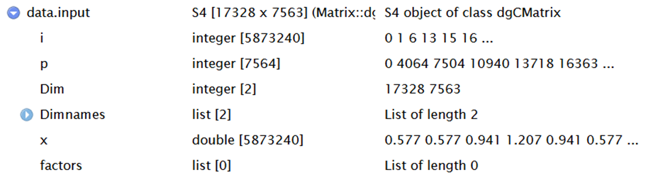
- `meta`
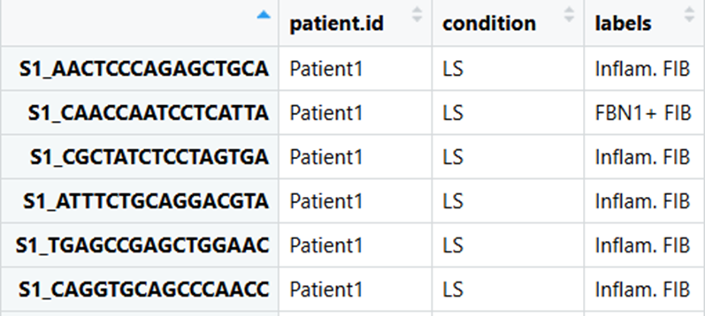

#### 2.1.2 Seleccionar las células de interés

En este paso se filtran las células que pertenecen a la condición LS, puesto que son las que se van a analizar.
```
cell.use = rownames(meta)[meta$condition == "LS"]
```
📤 **Salida esperada:** En el entorno de trabajo, en la sección *Values*, se encuentra `cell.use`, que consiste en un vector con los nombres (IDs) de las células seleccionadas.

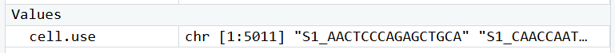

#### 1.1.3 Filtrar la matriz de expresión

Se conservan únicamente las columnas (células) que cumplen la condición seleccionada.

```
data.input = data.input[, cell.use]
```
📤 **Salida esperada:** Matriz de expresión reducida (solo las células LS).

#### 1.1.4 Filtrar los metadatos

Se ajusta el *data frame* de metadatos para que coincida con las células filtradas.

```
meta = meta[cell.use, ]
```
📤 **Salida esperada:** `meta` contiene solo la información de las células seleccionadas.

#### 1.1.5 Verificar los tipos celulares

Este comando permite visualizar los tipos celulares presentes en los datos.

```
unique(meta$labels)
```
📤 **Salida esperada:** Un vector que contiene las etiquetas únicas encontradas.

En este ejemplo, se identificaron 12 etiquetas posibles (desde Inflam. FIB hasta NKT). El *dataset* contiene diversos tipos celulares, principalmente:
- **Fibroblastos (FIB):** Inflamatorios, FBN1+, APOE+, COL11A1+.
- **Células Dendríticas (DC/cDC):** cDC1, cDC2, Inflam. DC.
- **Células T (TC):** CD40LG+, Inflam. TC, TC general.
- **Otros:** LC (Langerhans o Linfáticas) y NKT (células Natural Killer T).

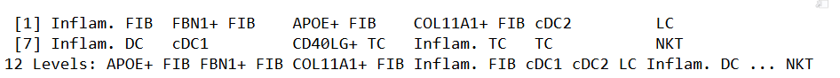


### 2.2 Crear el objeto CellChat
Una vez cargados los datos, el siguiente paso es convertirlos en un **objeto `CellChat`**, que será la estructura donde se almacenará todo el análisis:
```
cellchat <- createCellChat(object = data.input, meta = meta, group.by = "labels")
```
- `object = data.input` es el objeto Seurat.
- `group.by = "labels"` es la columna que contiene los tipos celulares.

📤 **Salida esperada:** Crea un objeto llamado `CellChat` que contiene los datos de expresión organizados por grupo celular y los metadatos, por ahora.

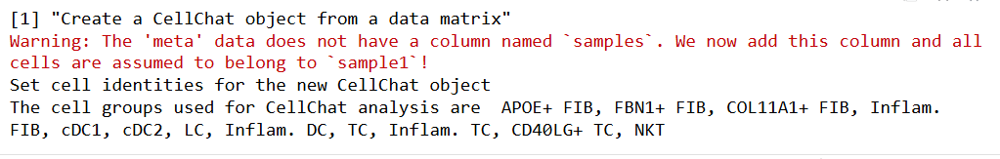

### 2.3 Añadir la base de datos

Recordemos que CellChat usa una base de datos llamada **CellChatDB**, que contiene los pares ligando–receptor conocidos. El algoritmo usa la matriz de expresión para detectar qué células podrían comunicarse usando esos pares.

Para ello, se selecciona la base de datos, en este escenario de humano, con las interacciones ligando-receptor. Si el *dataset* fuera de ratón usarías: `CellChatDB.mouse`
```
CellChatDB <- CellChatDB.human
```
📤 **Salida esperada:** Ahora el objeto `CellChat`contiene una inmesa lista de ligandos, receptores, complejos y cofactores.

Puedes verificarlo con:
```
showDatabaseCategory(CellChatDB)
```
📤 **Salida esperada:** Un resumen estadístico que muestra cómo está compuesta CellChatDB.

El primer gráfico muestra cómo ocurre la señalización celular. La base de datos incluye 4 tipos principales de comunicación: 
 1. **Secreted signaling:** Señales que una célula libera al espacio extracelular.
 2. **ECM-Receptor:** Interacciones con la matriz extracelular.
 3. **Cell-cell contact:** Señales que requieren contacto directo entre células.
 4. **Non-protein signaling:** Interacciones que no usan proteínas como ligando principal.

 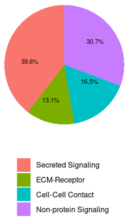

 El segundo gráfico muestra el tipo de complejo molecular, es decir, cómo están formados los receptores o ligandos. 
 > Un heterodímero es un receptor formado por dos proteínas distintas.

 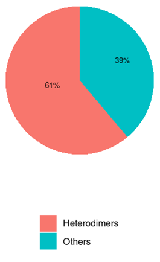
 
 El tercer gráfico muestra la fuente de evidencia. Esto demuestra de dónde provienen las interacciones de la base de datos. Ya sea de literatura científica o KEGG, que es una base de datos de rutas biológicas.

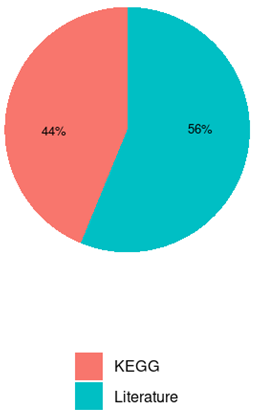

Para explorar detalladamente la estructura interna de la base de datos:
```
dplyr::glimpse(CellChatDB$interaction)
```
📤 **Salida esperada:** Una vista previa exhaustiva que confirma que estás trabajando con un catálogo muy robusto de 3,233 interacciones (filas) y 28 variables (columnas) que describen cada evento de comunicación.

Algunas de las columnas más importantes son:
- `interaction_name`: El identificador técnico de la pareja (ej. TGFB1_TGFBR1_TGFBR2). 
> CellChat agrupa complejos de receptores con un guion bajo.
- `pathway_name`: Agrupa las interacciones en vías biológicas (ej. todas las variantes de TGF-beta se agrupan en la vía TGFb). 
- `ligand y receptor:` Quién envía la señal y quién la recibe.
- `annotation:` Clasifica la interacción en las categorías mencionadas anteriormente.
- `evidence:` Es el respaldo científico (códigos de KEGG o IDs de PubMed) que garantiza que esa interacción está probada y no es una predicción al azar.
- Columnas de localización (`location`, `transmembrane`): Indican si el ligando es secretado al espacio extracelular o si el receptor está anclado a la membrana, lo cual es importante para la lógica biológica del modelo.

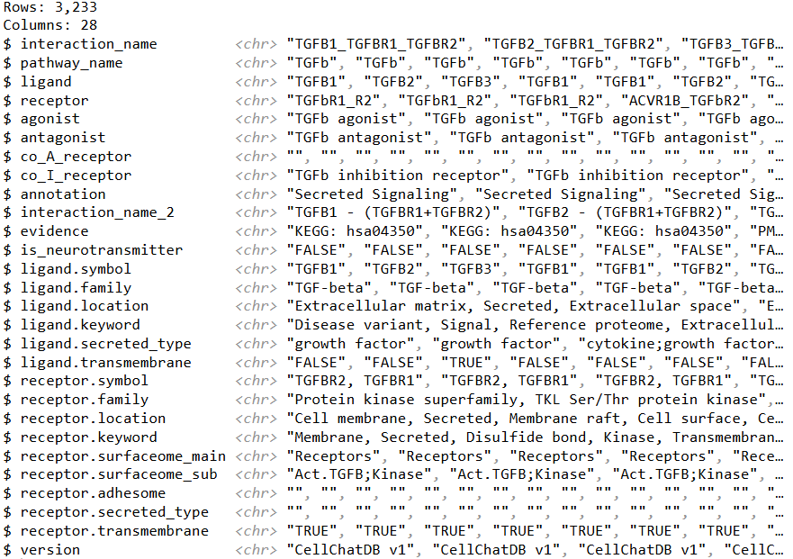

Puedes crear un subconjunto de CellChatDB para filtrar si hay algún el tipo de señalización en específico que desees explorar.
```
CellChatDB.use <- subsetDB(CellChatDB, search = "Secreted Signaling")
```

O puedes utilizar todas las interacciones posibles.
```
CellChatDB.use <- CellChatDB
```
Para guardar la base en el objeto. Esto le dice al objeto qué base de datos usar para detectar la comunicación celular.
```
cellchat@DB <- CellChatDB.use
```

### 2.3 Preprocesamiento: Filtrar genes relevantes

Ahora vamos a preparar los datos antes de calcular la comunicación entre células. Básicamente, CellChat intenta identificar qué ligandos y receptores están activos en cada tipo celular. Esto reduce el *dataset* a solo genes que participan en señalización celular. Elimina genes como los *housekeeping* y metabólicos, y conserva genes como los ligandos, receptores y cofactores, lo cual acelera el análisis.

> Este paso es obligatorio, incluso si usas toda la base de datos.

```
cellchat <- subsetData(cellchat)
```
📤 **Salida esperada:** Internamente se disminuye el número de genes analizados y se optimiza el rendimiento.

Analizar miles de células y calcular todas las posibles interacciones ligando-receptor (como las 3,233 que vimos previamente) requiere mucho esfuerzo computacional.

Al emplear:
```
future::plan("multiprocess", workers = 4)
```
Se hablita el procesamiento en paralelo en tu sesión de R. Es una forma de decirle a tu computadora: "No uses un solo núcleo de mi procesador; usa varios al mismo tiempo". Ej. R divide 10,000 células en 4 grupos de 2,500 y procesa cada grupo en un núcleo distinto al mismo tiempo. Esto puede reducir el tiempo de espera casi a la cuarta parte.

Mediante este comando, Cellchat busca genes de señalización que estén sobreexpresados en cada tipo celular.
```
cellchat <- identifyOverExpressedGenes(cellchat)
```

Para luego detectar genes ligando/receptor activos y entonces considerar una posible comunicación celular.
```
cellchat <- identifyOverExpressedInteractions(cellchat)
```
📤 **Salida esperada:** CellChat encontró 1645 pares ligando–receptor relevantes.


#### Proyección a red PPI (opcional):
Se usa una red de interacciones proteína–proteína: PPI. Sirve para corregir el problema de *dropout* en scRNAseq. 

>Dropout significa que un gen aparece con expresión 0 aunque sí esté activo. Esto pasa mucho con genes de señalización. La proyección usa difusión en la red proteica para suavizar la expresión.

```
cellchat <- projectData(cellchat, PPI.human)
```

**¿Debes usar projectData()?**

Depende.

- Recomendable si tienes poca profundidad de secuenciación o muchos genes que salen como 0.
- No siempre es necesario si tus datos están bien normalizados o tienes buena cobertura.

#### Evaluación de calidad
 Para revisar que no haya grupos con muy pocas células (ej. < 10) o niveles vacíos, el siguiente comando te muestra cuántas células tienes en cada tipo celular:
```
table(cellchat@idents)
```
📤 **Salida esperada:** Cada número es el tamaño de cada grupo celular.

CellChat usa estos tamaños para normalizar interacciones. No es lo mismo 1228 fibroblastos enviando señales vs 67 células LC. Los grupos grandes tienden a generar más interacciones.

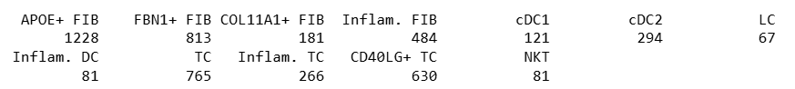

## 🗪 Parte 3. Inferencia de la comunicación celular
El objetivo de esta sección es transformar los datos de expresión génica en una representación de cómo se relacionan las células entre sí. Para ello, calcula una probablidad de interacción para cada par ligando-receptor entre los distintos grupos celulares.

¿Cómo calcula esa probabilidad? Utiliza la expresión de los genes (qué tanto se expresa el ligando en un grupo celular y el receptor en otro). Así como CellChatDB que indica qué ligandos interactúan con cuáles receptores.

El modelo matemático que implementa es la *Ley de acción de masas*, en términos sencillos significa que la probabilidad de comunicación aumenta cuando tanto el ligando como el receptor están altamente expresados. Después, CellChat aplica un *permutation test* (una prueba estadística basada en permutaciones) para evaluar si la interacción observada es significativa o podría explicarse por azar. Solo se conservan interacciones significativas.

Otro punto importante es cómo se calcula la expresión promedio de los genes en cada grupo celular, ya que esto afecta directamente a cuántas interacciones se detectan. Por defecto, CellChat utiliza un método llamado *trimean*, que es una forma robusta de promedio menos sensible a valores extremos. Este método tiende a ser más estricto, produciendo menos interacciones, pero con mayor confiabilidad. De hecho, si menos del 25% de las células en un grupo expresan un gen, el *trimean* lo considera prácticamente como no expresado, lo que reduce la detección de señales débiles o provenientes de poblaciones pequeñas.

Sin embargo, existen métodos alternativos, como el *truncated mean*, donde solo se eliminan los valores más extremos. Este enfoque es más permisivo y puede detectar más interacciones, incluyendo señales más sútiles. 

Además, CellChat proporciona funciones como `computeAveExpr` para explorar directamente la expresión promedio de genes específicos de interés.

Por otro lado, cuando se analizan datos de células individuales no separadas previamente (*unsorted*), CellChat también puede considerar el tamaño de cada población celular. Esto se basa en la idea de que poblaciones más abundantes pueden generar señales colectivamente más fuertes que poblaciones raras. Al activar esta opción `(population.size = TRUE)`, el modelo ajusta las probabilidades de interacción tomando en cuenta la proporción de células en cada grupo, lo cual puede hacer el análisis más realista, aunque también puede disminuir la visibilidad de interacciones provenientes de poblaciones pequeñas.

### 3.1 Calcular la probabilidad de comunicación

CellChat calcula la probabilidad de comunicación entre todos los grupos celulares usando la función `computeCommunProb`. Esto significa que, para cada par de tipos celulares, el programa evalúa qué tan probable es que exista señalización a través de todos los pares ligando-receptor conocidos.

Usa por defecto el método *trimean* para resumir la expresión génica por grupo.

```
cellchat <- computeCommunProb(cellchat)
```

📤 **Salida esperada:**: El resultado de esta función se guarda en el interior del objeto `CellChat`. Dentro de `object@options$parameter` se almacenan las probabilidades de comunicación y los parámetros usados en el cálculo. `CellChat` ya no es solo una matriz de datos; ahora contiene una red de comunicación.

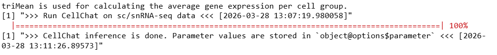

> Si hay vías de señalización conocidas que esperas ver pero no aparecen, puedes cambiar el método de promedio a uno menos estricto, como *truncated mean*.

### 3.1.1 Filtrar las interacciones poco confiables

Ahora que CellChat ya infirió quién habla con quién, se aplica un paso de control de calidad con la función `filterCommunication` al eliminar las interacciones que son demasiado débiles o poco significativas.
```
cellchat <- filterCommunication(cellchat, min.cells = 10)
```
En este caso, al utilizar `min.cells = 10`, significa que cualquier tipo celular con menos de 10 células será excluido del análisis de comunicación. Esto es relevante porque estimar interacciones con muy pocas células puede ser poco confiable y generar resultados ruidosos o falsos positivos.

📤 **Salida esperada:** Se almacena dentro del objeto `CellChat`.

### 2.2 Extraer la red de comunicación celular inferida

La función `subsetCommunication` se utiliza para extraer la red de comunicación celular en forma de data frame. Hasta ahora, toda la información está guardada dentro del objeto `CellChat`, pero no es fácil de ver directamente. Esta función hace posible convertir esas interacciones en algo más manejable, donde se puede ver claramente: qué célula envía la señal, cuál la recibe, qué ligando-receptor está involucrado y qué tan fuerte es la interacción.

Al usar:

```
df.net <- subsetCommunication(cellchat)
```
obtienes todas las interacciones inferidas a nivel de ligando-receptor.

📤 **Salida esperada:** Una tabla donde:
- **Filas:** Cada fila representa una interacción específica entre dos grupos de células.
- **Columnas:** Incluye el nombre del ligando, el receptor, la vía biológica (`pathway_name`), la probabilidad de comunicación (`prob`) y el valor de significancia estadística (`p-val`).

Es el paso previo indispensable para exportar los resultados a Excel o para crear gráficos.

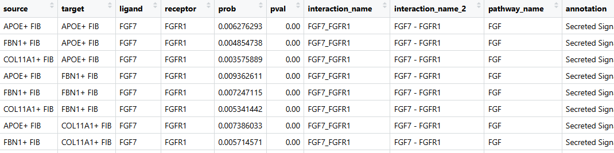

Si en lugar de eso usas `slot.name = "netP"`, entonces accedes a las interacciones a nivel de vías de señalización completas, no de pares individuales. Esto es útil porque muchas veces lo que te interesa no es un gen en particular, sino las rutas.

También puedes filtrar la información según lo que te interese. 

Si especificas `sources.use` y `targets.use`: 
```
df.net <- subsetCommunication(cellchat, sources.use = c(1,2), targets.use = c(4,5))
```
Estás seleccionando qué tipos celulares envían y cuáles reciben señales, lo cual es práctico si quieres enfocarte en interacciones específicas.

De forma similar, puedes filtrar por tipo de señalización usando el argumento `signaling`:
```
df.net <- subsetCommunication(cellchat, signaling = c("WNT", "TGFb"))
```
Lo que te permite quedarte solo con interacciones asociadas a vías específicas que te llamen la atención.

### 3.3 Inferir la comunicación celular a nivel de vía de señalización

Mediante la función `computeCommunProbPathway`, CellChat pasa de interacciones individuales a una visión más general. 

Lo que hace es agrupar todas las interacciones ligando-receptor que pertenecen a una misma vía de señalización y calcular una probabilidad global para esa vía. Es decir, en lugar de ver interacciones aisladas, puedes ver qué tan activa está una ruta completa de comunicación entre células.
```
cellchat <- computeCommunProbPathway(cellchat)
```

📤 **Salida esperada:** Las interacciones a nivel de ligando-receptor se guardan en `object@net`, mientras que las interacciones a nivel de vías de señalización se guardan en `object@netP`.

Para ver el listado de todas las vías que CellChat logró detectar tras correr este comando:
```
cellchat@netP$pathways
```
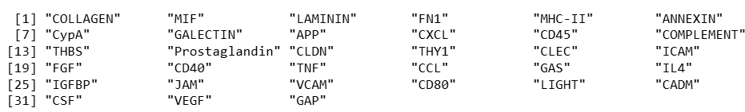


### 3.4 Calcular la red de comunicación agregada entre celdas

Después de haber calculado todas las interacciones célula-célula, la función `aggregateNet` se utiliza para resumir esa información en una red más simple. En lugar de ver miles de pares ligando-receptor individuales, aquí CellChat agrupa todo y calcula, para cada par de tipos celulares, dos cosas principales:

1. El número de interacciones que existen entre ellos, y
2. La fuerza total de comunicación (sumando las probabilidades de todas las interacciones).

Esto te permite responder preguntas más globales, como: ¿qué tipo celular es el que más se comunica? o ¿qué interacción entre las células es más fuerte en general? 

Además, si te interesa solo un subconjunto de células, puedes usar `sources.use` y `targets.use` para enfocarte en interacciones específicas.

```
cellchat <- aggregateNet(cellchat)
```

📤 **Salida esperada:** Se almacena dentro del objeto `CellChat`.

Una vez que se dispone de esta red agregada, es posible visualizarla. Para eso se usa `netVisual_circle`, que genera un diagrama circular (*Circle plot*) tipo red donde:
- Cada nodo representa un tipo celular.
- El tamaño del nodo (usando `groupSize`) indica cuántas células hay en ese grupo.
- Las líneas representan la comunicación entre las células.

Cuando se utiliza `cellchat@net$count`, se visualiza el número de interacciones entre cada par celular. En cambio, cuando se usa `cellchat@net$weight`, se ve la fuerza total de la comunicación. Esto es importante porque no siempre más interacciones significa señales más fuertes; a veces hay pocas interacciones pero muy potentes.

```
groupSize <- as.numeric(table(cellchat@idents))
par(mfrow = c(1,2), xpd=TRUE)
netVisual_circle(cellchat@net$count, vertex.weight = groupSize, weight.scale = T, label.edge= F, title.name = "Number of interactions")
netVisual_circle(cellchat@net$weight, vertex.weight = groupSize, weight.scale = T, label.edge= F, title.name = "Interaction weights/strength")
```

📤 **Salida esperada:** *Circle Plot* que resume la red global de comunicación celular del dataset. 

1. **Number of interactions:** Mide la cantidad bruta de pares ligando-receptor únicos que se están "hablando" entre dos grupos. El grosor de las líneas indica cuántas vías diferentes están activas. Si una línea es muy gruesa, significa que esos dos grupos tienen un "diálogo" muy diverso (muchos ligandos y receptores distintos interactuando).
2. **Interaction weights/strength:** Evalúa la intensidad o fuerza de la señal (la probabilidad de comunicación). No importa cuántas vías haya, sino qué tan fuerte es la señalización total. Aquí el grosor indica dónde hay una señalización "fuerte" o muy expresada. Los círculos que salen y entran al mismo grupo (bucles) representan la señalización autocrina, es decir, células que se envían señales a sí mismas.

Los tipos celulares con más líneas actúan como nodos centrales o *hubs* que coordinan la respuesta en el tejido.

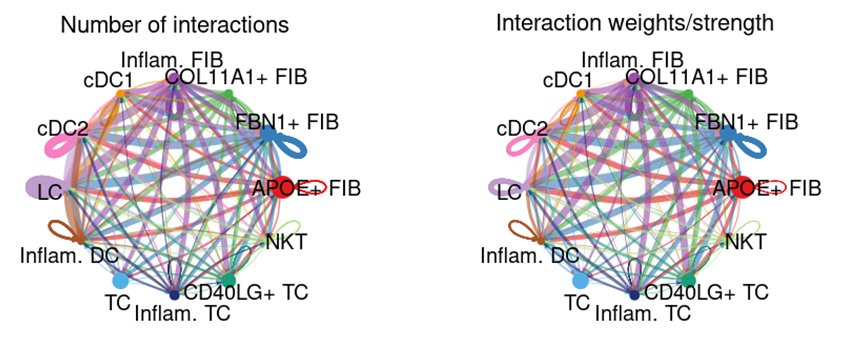

 Debido a que estas redes pueden volverse muy complejas (muchos tipos celulares conectados entre sí), es posible analizar la comunicación célula por célula. 
 
 Lo que hace el loop es tomar cada tipo celular como emisor y mostrar únicamente las señales que salen de él hacia los demás. Para lograrlo, crea una matriz (`mat2`) donde solo se conserva una fila a la vez (la del emisor actual), mientras que el resto se pone en cero.

Esto permite ver:
- Qué células están enviando más señales.
- Hacia qué tipos celulares se dirigen.
- Qué tan fuertes son esas interacciones.

 El parámetro `edge.weight.max` es relevante porque fija una escala común para todas las gráficas. Así se puede comparar visualmente entre las diferentes células sin que cambie la escala de los pesos de las interacciones.

```
mat <- cellchat@net$weight
par(mfrow = c(3,4), xpd=TRUE)
for (i in 1:nrow(mat)) {
  mat2 <- matrix(0, nrow = nrow(mat), ncol = ncol(mat), dimnames = dimnames(mat))
  mat2[i, ] <- mat[i, ]
  netVisual_circle(mat2, vertex.weight = groupSize, weight.scale = T, edge.weight.max = max(mat), title.name = rownames(mat)[i])
}
```

📤 **Salida esperada:** Un *Circle Plot* que muestra una descomposición de la red de comunicación, donde cada panel individual visualiza las señales enviadas exclusivamente por un solo tipo de célula (el emisor) hacia todos los demás (los receptores).

Es la forma más clara de identificar el rol específico de cada población en el tejido.

El grosor de las flechas indica una mayor fuerza de señalización. Un panel con muchas flechas indica una población "parlanchina" que regula a casi todo el sistema Los lazos sobre la propia célula dan lugar a señales de autorregulación (autocrinas).

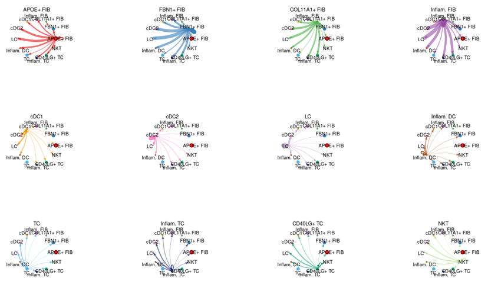

## 📶 Parte 4. Visualización de la comunicación celular

En esta sección, se procede a interpretar los resultados visualmente, es momento de explorar la red de comunicación que se constureyó.

### 4.1 Visualizar cada vía de señalización utilizando diagramas

 CellChat ofrece varias formas de representar la comunicación célula-célula, cada una con un propósito distinto. Entre las principales están: el *hierarchy plot* (diagrama de jerarquía), el *circle plot*, el *chord diagram* (diagrama de cuerdas) y el *bubble plot* (diagrama de burbujas). Todas estas representaciones proyectan quién le habla a quién, pero desde diferentes perspectivas: algunas enfatizan la dirección, otras la intensidad, y otras la organización global de la red.

 Además, no solo muestra conexiones, sino que también permite analizar información de alto nivel, como cuáles son las células que más envían señales (*outputs*), cuáles reciben más (*inputs*), y cómo se coordinan entre sí mediante distintas vías de señalización.

 Una de las visualizaciones más informativas es el *hierarchy plot*. En este tipo de gráfico, cada usuario decide qué células quiere analizar como “receptoras principales” usando la función `vertex.receiver`. 

```
 pathways.show <- c("CXCL")  
vertex.receiver = seq(1,4) # a numeric vector. 
netVisual_aggregate(cellchat, signaling = pathways.show,  vertex.receiver = vertex.receiver)
par(mfrow=c(1,1))
netVisual_aggregate(cellchat, signaling = pathways.show, layout = "circle")
```

 El gráfico se divide en dos partes:
- A la izquierda, se muestran las señales dirigidas hacia las células que se definieron.
- A la derecha, se muestran las señales hacia el resto de las células.

 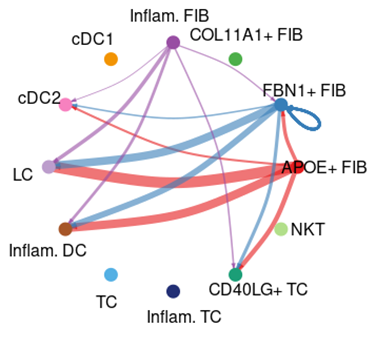

 El *circle plot* es el más utilizado. Representa todos los tipos celulares como nodos en un círculo y dibuja conexiones entre ellos. Aquí se ver rápidamente: qué células están más conectadas, qué interacciones son más fuertes (líneas más gruesas) y qué poblaciones son más grandes (nodos más grandes). Es ideal para tener una visión general de la red completa.

 El *chord diagram* es otra forma de visualizar la red, pero más a profundidad. Tiene dos variantes:
 - `netVisual_chord_cell`: Muestra interacciones entre tipos celulares (cada sector es un tipo celular).
 - `netVisual_chord_gene`: Muestra interacciones a nivel de ligando-receptor o vías.

 Otra ventaja importante es que puedes agrupar células, lo cual simplifica mucho la interpretación cuando tienes muchos clusters. Además, los colores y las barras internas ayudan a entender quién envía y quién recibe señales, aunque a veces puede verse complejo.

 ```
group.cellType <- c(rep("FIB", 4), rep("DC", 4), rep("TC", 4))
names(group.cellType) <- levels(cellchat@idents)
netVisual_chord_cell(cellchat, signaling = pathways.show, group = group.cellType, title.name = paste0(pathways.show, " signaling network"))
```
También es posible visualizar la comunicación en dos niveles distintos:
 - A nivel de vía de señalización completa (por ejemplo, CXCL, WNT, TGFβ) usando `netVisual_aggregate`.
 - A nivel de pares ligando-receptor individuales usando `netVisual_individual`.

Así, primero se proyecta el panorama general (qué vías están activas) y luego a detalle (qué genes específicos lo están causando).

```
par(mfrow=c(1,1))
netVisual_aggregate(cellchat, signaling = pathways.show, layout = "chord")
```

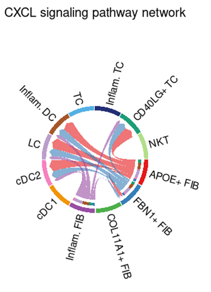

```
netVisual_individual(cellchat, signaling = pathways.show, pairLR.use = LR.show, layout = "chord")
```
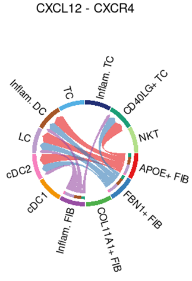

#### Reglas comunes de interpretación de los diagramas:
 - El color de las líneas indica la célula que envía la señal.
 - El grosor de las líneas indica qué tan fuerte es la interacción.
 - El tamaño de los nodos refleja el número de células en cada grupo.
 - En algunos gráficos, se distingue entre célula emisora y receptora con diferentes estilos (por ejemplo, círculos sólidos vs abiertos).

 A diferencia de los diagramas de red que pueden volverse complejos cuando hay muchos tipos celulares, el *heatmap* ofrece una estructura más limpia y legible.

 En este gráfico, CellChat organiza la información de la siguiente manera:
 - **Filas (Eje Y):** Representan las células emisoras que secretan los ligandos.
 - **Columnas (Eje X):** Representan las células receptoras que expresan los receptores.
 
 Al usar `color.heatmap = "Reds`, un rojo más oscuro indica una probabilidad de comunicación más alta.

 ```
par(mfrow=c(1,1))
netVisual_heatmap(cellchat, signaling = pathways.show, color.heatmap = "Reds")
 ```
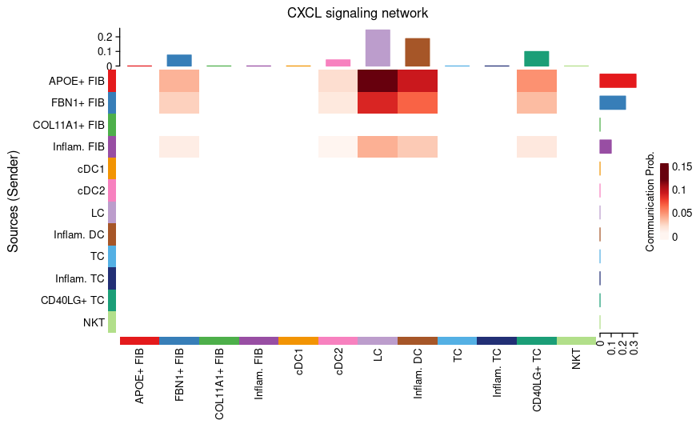

 Se puede acceder a todas las vías de señalización que muestran comunicaciones significativas mediante la función `cellchat@netP$pathways`.

### 4.2 Calcular la contribución de cada par ligando-receptor a la vía de señalización general y visualizar la comunicación celular por un único par

La función `netAnalysis_contribution` se emplea para cuantificar cuánto aporta cada par ligando-receptor a una vía de señalización específica. 

En este ejemplo, se analiza la vía CXCL, esta función dice qué interacciones particulares son las que realmente están “cargando” la señal. Esto es relevante porque una vía puede tener muchos pares L-R asociados, pero no todos contribuyen igual; algunos son dominantes y otros casi no influyen.

```
netAnalysis_contribution(cellchat, signaling = pathways.show)
```
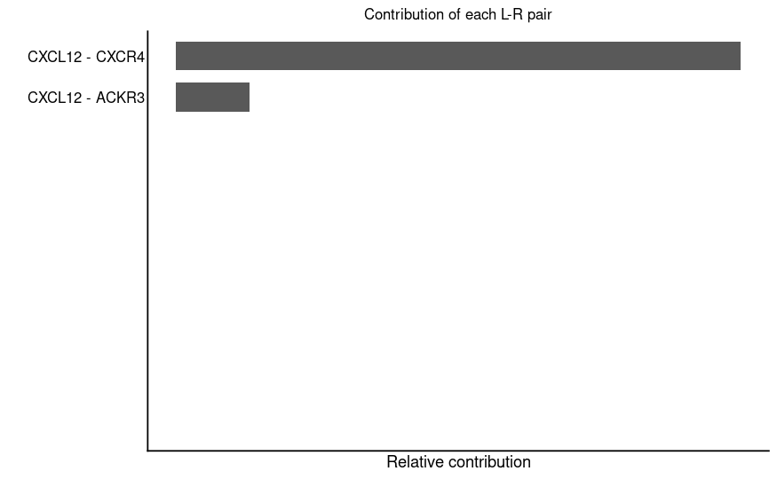

Para extraer los pares L-R significativos dentro de una vía, se puede usar `extractEnrichedLR`. Lo cual regresa una lista de interacciones que pasaron los filtros estadísticos y que, por lo tanto, son de interés. 

```
pairLR.CXCL <- extractEnrichedLR(cellchat, signaling = pathways.show, geneLR.return = FALSE)
LR.show <- pairLR.CXCL[1,] 
vertex.receiver = seq(1,4) 
netVisual_individual(cellchat, signaling = pathways.show,  pairLR.use = LR.show, vertex.receiver = vertex.receiver)
netVisual_individual(cellchat, signaling = pathways.show, pairLR.use = LR.show, layout = "circle")
```
En este ejemplo, se guardan estos pares en `pairLR.CXCL` y luego se selecciona uno solo (`LR.show <- pairLR.CXCL[1,]`) para analizarlo con precisión.

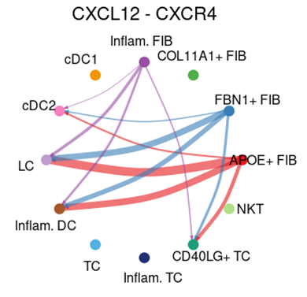

### 4.3 Guarda automáticamente los gráficos de toda la red inferida

Ahora bien, en lugar de analizar una vía de señalización a la vez, se puede recorrer todas las vías detectadas por CellChat y generar automáticamente sus gráficas. Esto se hace con un `for ... loop`, lo cual ahorra mucho tiempo, sobre todo cuando tienes muchas rutas.

Primero, con `cellchat@netP$pathways` se obtiene la lista de todas las vías de señalización que resultaron significativas en el análisis. Esa lista se guarda en `pathways.show.all`, y será lo que el loop va a recorrer una por una.

En consecuencia, es importante revisar el orden de los tipos celulares con `levels(cellchat@idents)`, porque de eso depende cómo defines `vertex.receiver`. Este parámetro indica qué células quieres resaltar como receptoras en el plot. 

Dentro del loop pasan dos cosas. Primero, se emplea `netVisual` para generar automáticamente la visualización de la red de comunicación para cada vía. Después, se calcula la contribución de cada par ligando-receptor con `netAnalysis_contribution`, y ese resultado se guarda como un objeto gráfico `gg`. Luego, con `ggsave`, se exporta directamente como archivo PDF. El nombre del archivo incluye el nombre de la vía, lo que hace que todo quede organizado automáticamente.
```
pathways.show.all <- cellchat@netP$pathways
levels(cellchat@idents)
vertex.receiver = seq(1,4)
for (i in 1:length(pathways.show.all)) {
  netVisual(cellchat, signaling = pathways.show.all[i], vertex.receiver = vertex.receiver, layout = "hierarchy")
  gg <- netAnalysis_contribution(cellchat, signaling = pathways.show.all[i])
  ggsave(filename=paste0(pathways.show.all[i], "_L-R_contribution.pdf"), plot=gg, width = 3, height = 2, units = 'in', dpi = 300)
}
```

> Un detalle a considerar es que este loop genera muchas gráficas, así que asegúrate de definir una carpeta específica para guardarlas.

### 4.4 Visualizar la comunicación celular mediada por múltiples ligandos-receptores o vías de señalización

Hay una opción para observar muchas interacciones al mismo tiempo, en lugar de enfocarte en una sola vía o un solo par L-R. Esto es práctico cuando se quiere identificar patrones generales o comparar grupos celulares.

El *bubble plot* (`netVisual_bubble`) es una forma muy intuitiva de ver múltiples interacciones simultáneamente. En este gráfico, cada punto representa un par ligando-receptor entre un tipo celular emisor y uno receptor. 

Usualmente:
 - El eje X y Y representan combinaciones de células o interacciones.
 - El tamaño del punto indica la fuerza o importancia de la interacción.
 - El color suele representar la significancia o intensidad.

Para mostrar todas las interacciones significativas de algunos grupos de células con otros.

> Al definir `sources.use` y `targets.use`, se controla exactamente qué células se quieren analizar.
```
netVisual_bubble(cellchat, sources.use = 4, targets.use = c(5:11), remove.isolate = FALSE)
```
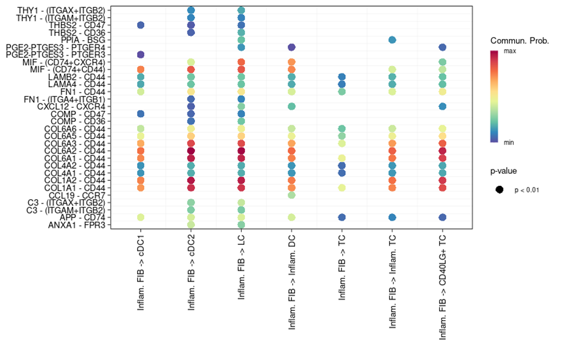

También es posible restringir el análisis a ciertas vías de señalización usando el argumento `signaling`.

```
netVisual_bubble(cellchat, sources.use = 4, targets.use = c(5:11), signaling = c("CCL","CXCL"), remove.isolate = FALSE)
```
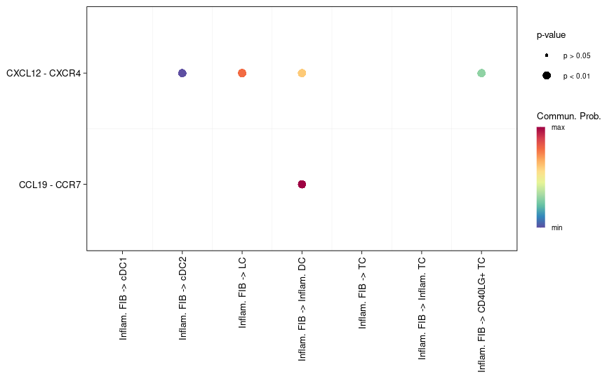

Otra opción es usar `pairLR.use`, donde tú defines exactamente qué pares L-R quieres observar.

```
pairLR.use <- extractEnrichedLR(cellchat, signaling = c("CCL","CXCL","FGF"))
netVisual_bubble(cellchat, sources.use = c(3,4), targets.use = c(5:8), pairLR.use = pairLR.use, remove.isolate = TRUE)
```

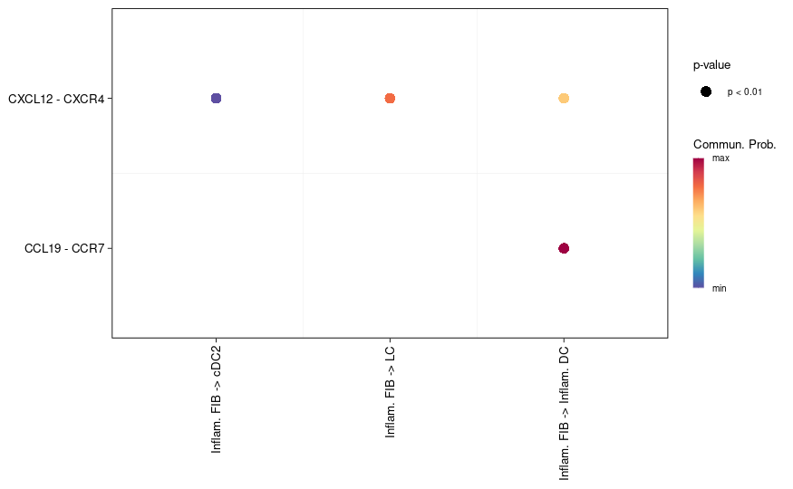

Por otro lado, el *chord diagram* a nivel de genes (`netVisual_chord_gene`) es similar, pero más visual y denso. Aquí cada segmento del círculo puede representar un ligando, receptor o incluso una vía, y las conexiones muestran cómo fluye la señal entre las células.

Con este diagrama:
- Puedes ver todas las señales que salen de un tipo celular, o todas las señales que recibe un tipo celular específico o incluso restringirlo a ciertas vías de señalización.
- Puedes examinar la comunicación desde diferentes perspectivas: como emisor, como receptor, o como red completa.

Para mostrar todas las interacciones significativas de algunos grupos de células con otros:

```
netVisual_chord_gene(cellchat, sources.use = 4, targets.use = c(5:11), lab.cex = 0.5,legend.pos.y = 30)
```
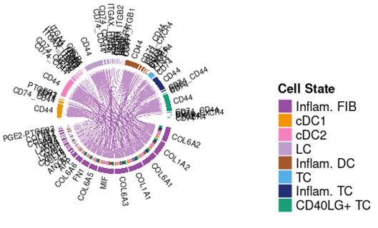

Para mostrar todas las interacciones significativas asociadas con ciertas vías de señalización:
```
netVisual_chord_gene(cellchat, sources.use = c(1,2,3,4), targets.use = c(5:11), signaling = c("CCL","CXCL"),legend.pos.x = 8)
```
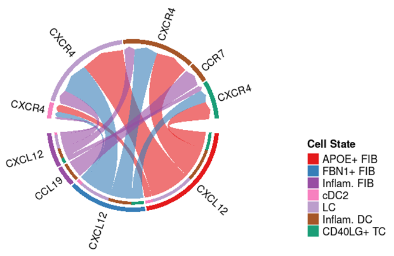

###  4.5 Representa gráficamente cómo se expresan los genes de señalización

Si quisieras proyectar cómo se expresan los genes involucrados en la señalización en los distintos grupos celulares, es posible mediante la función `plotGeneExpression`. Es básicamente un *wrapper* de Seurat, es decir, una función de paquetes de extensión que automatiza la creación de visualizaciones de la expresión de genes específicos a través de diferentes grupos de células.

En comparación con las funciones estándar, un *wrapper* de este tipo suele combinar varios pasos en uno solo: la extracción de los datos, agrupación y renderización para generar representaciones como:
- `Violin plots`: Muestran la distribución de la expresión por tipo celular.
- `Dot plots`: Resumen la expresión y el porcentaje de células que expresan el gen.

También se puede observar la expresión de todos relacionados con una vía en específico utilizando el argumento `signaling`.

```
plotGeneExpression(cellchat, signaling = "CXCL")
```
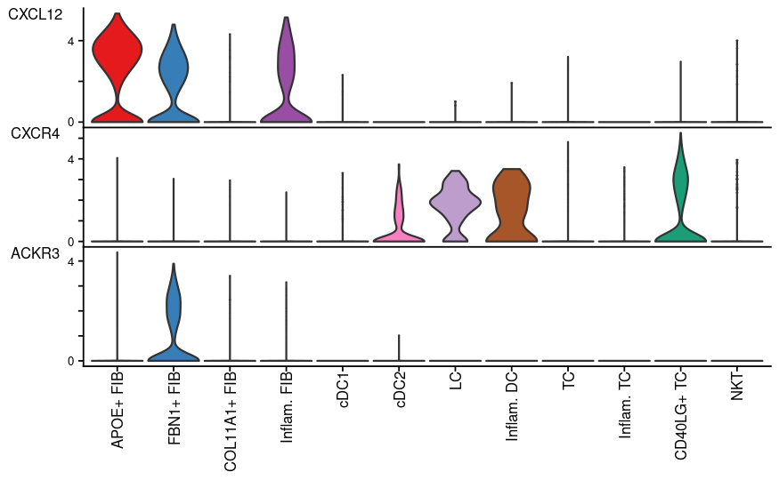

Por defecto, esta función solo muestra los genes que participaron en interacciones significativas. Sin embargo, si usas `enriched.only = FALSE`, entonces verás todos los genes asociados a esa vía, incluso los que no resultaron significativos en la comunicación.

```
plotGeneExpression(cellchat, signaling = "CXCL", enriched.only = FALSE)
```

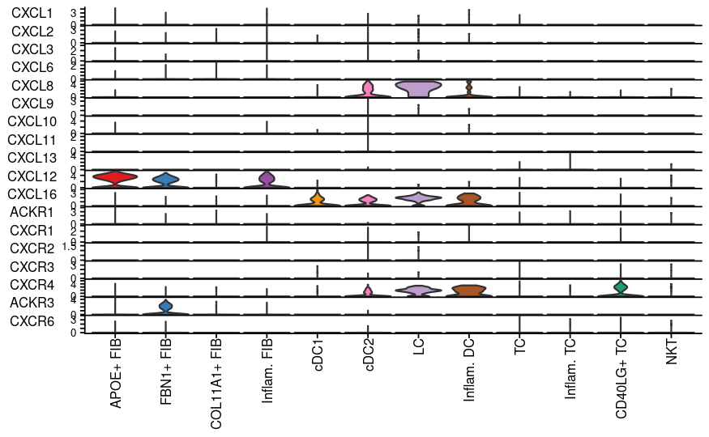

Asmimiso, es posible extraer los genes manualmente empleando `extractEnrichedLR` y luego graficarlos con `VlnPlot` o `DotPlot`.

## 📝 Parte 5. Análisis de sistemas de redes de comunicación célula-célula

En esta sección, el propósito  es entender el sistema de comunicación de forma integral, no solo quién se comunica con quién, sino qué papel juega cada tipo celular dentro de toda la red.

Para lograr esto, CellChat utiliza conceptos de la teoría de grafos, específicamente calcula medidas de centralidad, es decir, toma los resultados de la señalización celular y los traduce en métricas matemáticas para identificar roles funcionales de los distintos tipos celulares. 

Determina cuatro métricas clave para cada grupo celular:
1. **Out-degree:** Mide la cantidad total de señales que una célula envía, lo que facilita detectar a los emisores principales. 
2. **In-degree:** Mide cuántas señales recibe una célula, ayudando a reconocer a los receptores dominantes.
3. **Flow betweenness:** Localiza células que actúan como intermediarias en la comunicación.
4. **Information centrality:** Evalúa qué tan influyente es un grupo celular dentro de toda la red.

 ### 5.1 Calcula y visualiza las puntuaciones de centralidad de la red

Al utilizar la función `netAnalysis_computeCentrality`, CellChat calcula todas estas métricas utilizando la red de comunicación inferida a nivel de vías de señalización (almacenada en `netP`). Posteriormente, con `netAnalysis_signalingRole_network`, se visualizan estos resultados en un *heatmap*.

```
cellchat <- netAnalysis_computeCentrality(cellchat, slot.name = "netP")
netAnalysis_signalingRole_network(cellchat, signaling = pathways.show, width = 8, height = 2.5, font.size = 10)
```

En este gráfico, cada fila representa un tipo celular y cada columna una métrica de centralidad. La intensidad del color indica qué tan fuerte es el rol de esa célula como emisora, receptora, mediadora o influenciadora.

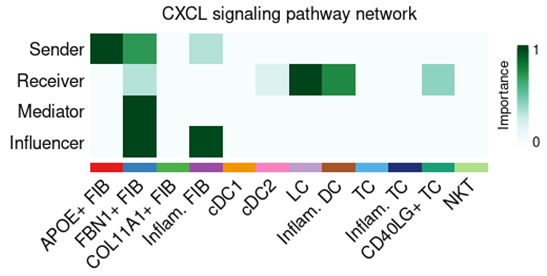

En lugar de tener una lista enorme de interacciones, puedes distinguir rápidamente qué células están dominando la conversación, cuáles responden más activamente, y cuáles coordinan la interacción entre diferentes poblaciones.

### 5.2 Visualizar a los emisores y receptores dominantes en un espacio 2D

CellChat proporciona herramientas visuales e intuitivas para entender los roles de cada tipo celular dentro de la red de comunicación.

Primero, el análisis con `netAnalysis_signalingRole_scatter` proyecta a cada tipo celular en un gráfico de dispersión (2D), donde cada punto es un tipo celular, y su posición está determinada por dos ejes principales: la capacidad de enviar señales (**outgoing**) y la capacidad de recibir señales (**incoming**). 

Esto permite clasificar visualmente a las células en distintos comportamientos. Por ejemplo, las que están hacia la derecha suelen ser fuertes emisoras, las que están hacia arriba son fuertes receptoras, y las que están en la esquina superior derecha son células muy activas que tanto envían como reciben señales.

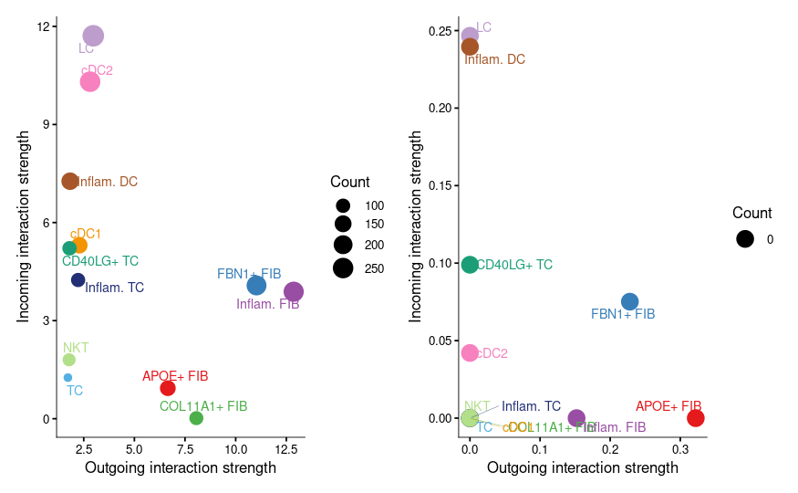

### 5.3 Identificar las señales que más contribuyen a la señalización saliente o entrante de ciertos grupos celulares

El análisis con `netAnalysis_signalingRole_heatmap` responde una pregunta más detallada: ¿qué señales específicas son las que más contribuyen a que una célula envíe o reciba comunicación? Aquí el *heatmap* no muestra roles generales, sino que descompone esos papeles en términos de vías de señalización. 

En el eje vertical se observa un listado de todas las vías de señalización detectadas, mientras que en el eje horizontal los diferentes tipos celulares. Los colores más intensos indican una mayor contribución de ese grupo celular a esa vía específica. Podrás ver qué grupos celulares son los emisores más fuertes para cada ligando y cuáles son los receptores principales.

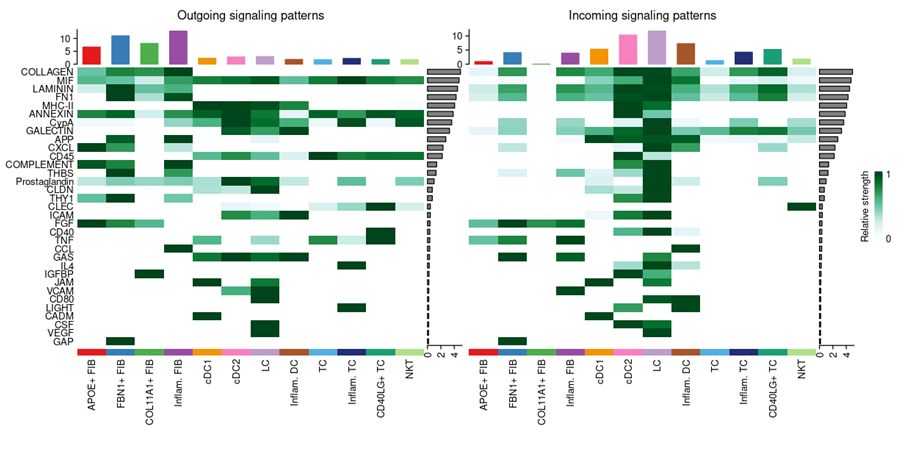

Nuevamente, si ocupas el argumento `signaling` te concentras en vías específicas.

### 5.4 Detectar y visualizar el patrón de comunicación saliente de las células secretoras

A continuación, se va a explorar los patrones generales de comunicación saliente. Es decir, busca responder: ¿existen grupos de células que tienden a usar conjuntos similares de señales para comunicarse? Esto se conoce como *outgoing communication patterns*.

Para lograrlo, CellChat utiliza una técnica de aprendizaje llamada factorización de matrices no negativas (*Non-negative Matrix Factorization*, NMF). Esta técnica toma la enorme cantidad de interacciones L-R y las simplifica en patrones. Se usa para identificar cuántos patrones de emisión o recepción existen en tus datos. Por ejemplo, ayuda a descubrir qué vías se comportan de forma similar en un grupo de células, agrupándolas en un solo módulo funcional.

> No existen expresiones de genes negativas; o un gen se expresa (positivo) o no (cero). NMF sigue esta lógica para que los resultados tengan sentido.

Primero se requiere llamar a las dos librerías esenciales:
- **NMF:** Descompone la red de comunicación en un número reducido de patrones. 
- **ggalluvial:** Extensión de `ggplot2` diseñada para crear gráficos donde se observa "ríos" o flujos que conectan diferentes categorías.

```
library(NMF)
library(ggalluvial)
```
Antes de definir los patrones, se usa la función `selectK` para decidir cuántos patrones de comunicación existen realmente en los datos. De forma más simple te dice si tu complejo sistema de células se puede resumir en 3, 5 o 10 conversaciones principales.
```
selectK(cellchat, pattern = "outgoing")
```

Al ejecutarlo, CellChat devolverá dos gráficos de líneas con puntos que muestran métricas de calidad:
- **Cophenetic Correlation (Correlación Cofenética):** Mide la estabilidad de los patrones. Lo ideal es que este valor sea cercanos a 1. Cuando la línea empieza a caer bruscamente, indica que estás forzando al modelo a crear demasiados patrones que no son reales.
- **Silhouette (Coeficiente de silueta):** Evalúa qué tan bien está asignado cada dato a su grupo celular. Igualmente tiene que ser cercano a 1.

Para elegir el valor de K (el número de patrones), es necesario buscar el "punto de codo" o el valor máximo antes de una caída drástica. El punto ideal es aquel donde la Correlación Cofenética todavía es alta, pero justo antes de que empiece a bajar rápido. Si eliges un K muy bajo, estás simplificando demasiado. Si eliges un K muy alto, estás separando señales que deberían ir juntas.

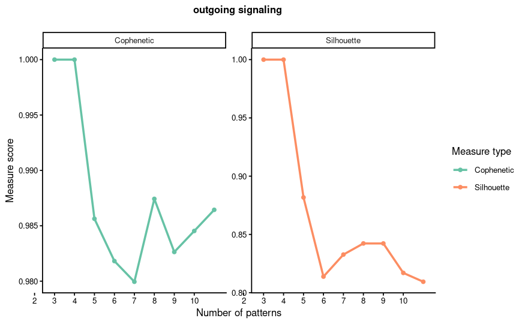

En este caso, el número óptimo de patrones para el análisis de señalización saliente se encuentra alrededor de k = 3 – 4, ya que en este rango se observan los valores más altos tanto del Coeficiente Cophenetic como del Coeficiente Silhouette. 

Por eso, en un siguiente paso se fija `nPatterns = 4` y luego se ejecuta `identifyCommunicationPatterns`. La figura de la izquierda muestra qué células dominan cada patrón y la figura de la derecha qué señales lo caracterizan.

```
nPatterns = 4
cellchat <- identifyCommunicationPatterns(cellchat, pattern = "outgoing", k = nPatterns)
```

Para interpretarlo: 
- Cada columna es un patrón (*Pattern 1–4*).
- Cada fila:
  - Izquierda: Tipos celulares.
  - Derecha: Vías de señalización.
- El color indica el nivel de contribución:
  - Rojo: Alto.
  - Azul: Bajo.

Los árboles a la izquierda de cada *heatmap* agrupan las células y señales, según la similitud en sus patrones.


En consecuencia, CellChat visualiza estos patrones con dos tipos de gráficas. 

La primera es el *river plot* usando `netAnalysis_river`. Este gráfico conecta tres cosas: los tipos celulares, los patrones y las vías de señalización. Gracias a un proceso de normalización y filtrado, cada célula y cada vía se asignan principalmente a un solo patrón, lo que hace que el flujo sea más claro. Aquí puedes ver, por ejemplo, qué grupos celulares comparten el mismo programa de señalización y qué vías están asociadas a ese programa.

```
netAnalysis_river(cellchat, pattern = "outgoing")
```
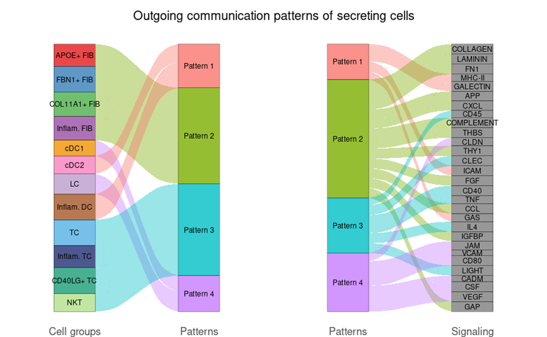

La segunda visualización es el *dot plot* (`netAnalysis_dot`). Este gráfico es más directo debido a que muestra la relación entre los tipos celulares y las vías de señalización, donde el tamaño del punto representa qué tanto contribuye una célula a una señal específica.
```
netAnalysis_dot(cellchat, pattern = "outgoing")
```
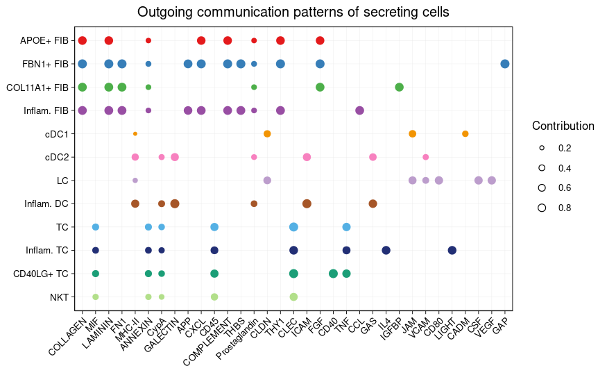

 Además, puedes ajustar el parámetro `cutoff` para ser más o menos estricto y así visualizar más o menos señales.

### 5.5 Identificar y visualizar el patrón de comunicación entrante de las células objetivo

CellChat aplica exactamente la misma lógica que en los patrones de salida, pero ahora desde el punto de vista opuesto: las células que reciben señales. Es decir, en lugar de preguntarse cómo las células envían información, aquí la pregunta es: ¿cómo responden las células a las señales que reciben y qué patrones comunes existen en esa respuesta?

Los *incoming communication patterns* representan programas coordinados de respuesta. Esto significa que algunos tipos celulares pueden compartir formas similares de reaccionar a señales externas, utilizando conjuntos parecidos de vías de señalización.

De nuevo, primero se utiliza `selectK(cellchat, pattern = "incoming")` para determinar cuántos patrones existen en los datos.

```
selectK(cellchat, pattern = "incoming")
```

En este otro escenario, el valor óptimo también es k = 4, porque a partir de ahí las métrica disminuyen, indicando que agregar más patrones ya no mejora la estructura del modelo.

> Comparado con el *outgoing signaling*, el *incoming* suele ser más complejo porque una célula puede recibir señales de múltiples fuentes.

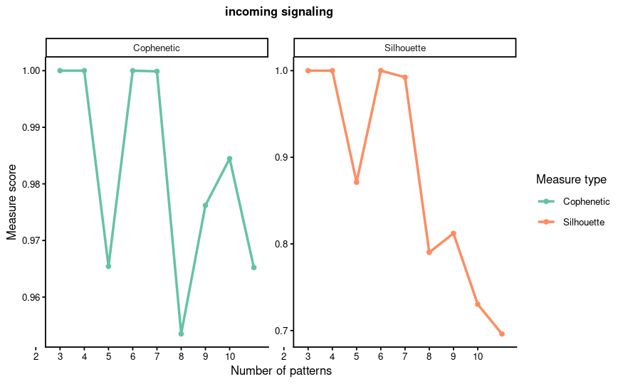

Después, con `identifyCommunicationPatterns`, CellChat usa NMF para descomponer la red en esos tres patrones, como ya vimos anteriormente.

```
nPatterns = 4
cellchat <- identifyCommunicationPatterns(cellchat, pattern = "incoming", k = nPatterns)
```

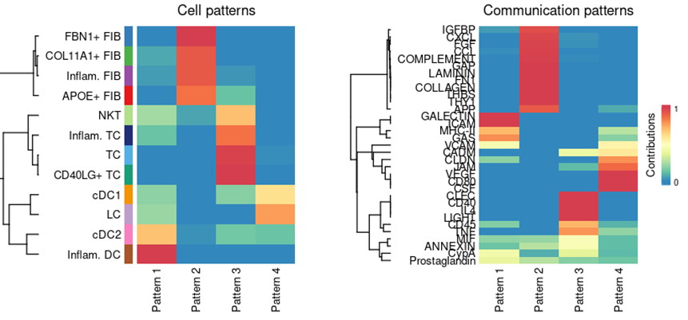

De igual forma, con `netAnalysis_river` es posible ver cómo se conectan los tipos celulares y las vías de señalización con los patrones. Es relevante mencionar que cada célula y cada vía quedan asociadas principalmente a un solo patrón, lo que facilita identificar qué grupos celulares comparten el mismo tipo de respuesta y qué señales están implicadas.

```
netAnalysis_river(cellchat, pattern = "incoming")
```

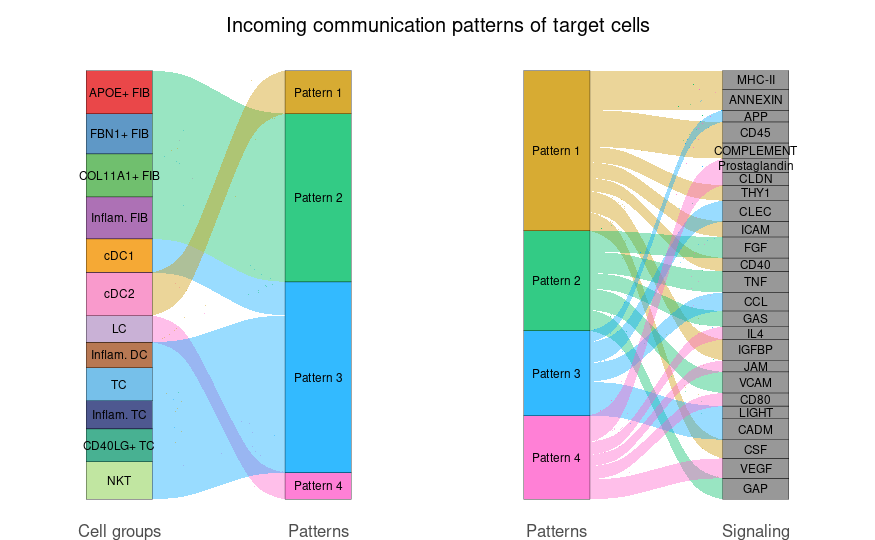

Por otro lado, el `netAnalysis_dot` muestra de manera más cuantitativa la relación entre las células y las vías de señalización. Aquí, el tamaño de los puntos indica qué tan fuerte es la contribución de cada vía a la respuesta de cada tipo celular.

```
netAnalysis_dot(cellchat, pattern = "incoming")
```
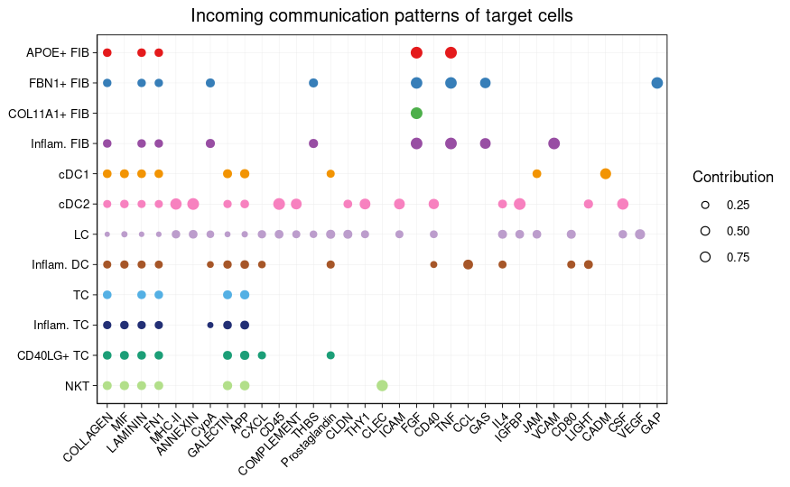

### 5.6 Análisis de aprendizaje de variedades y clasificación de redes de señalización

Una vez realizado todo lo anterior, CellChat se enfoca en comparar entre sí las vías de señalización. La idea central es responder: ¿qué señales se comportan de forma similar dentro de la red de comunicación celular?

Para hacer esto, CellChat calcula una medida de similitud entre todas las vías de señalización. Esto permite agruparlas en familias o conjuntos de señales que tienen comportamientos parecidos. Este análisis es importante porque muchas veces distintas vías pueden tener funciones redundantes o actuar de manera coordinada en procesos biológicos similares.

Existen dos formas principales de medir esta similitud. La primera es la **similitud funcional**, que compara las vías basándose en quién envía y quién recibe las señales. Si dos vías tienen emisores y receptores similares, entonces probablemente cumplen funciones biológicas parecidas o repetitivas.

La segunda es la **similitud estructural**, que ignora la identidad de las células y se enfoca únicamente en la forma de la red. Es decir, compara cómo están conectadas las señales entre sí (la topología), sin importar exactamente qué células participan. 

El flujo de análisis es en ambos casos el mismo. Primero, con `computeNetSimilarity`, CellChat calcula qué tan similares son las vías. Luego, con `netEmbedding`, reduce la complejidad de esos datos usando técnicas de *variedades de aprendizaje* (*manifold learning*, tipo de reducción de dimensionalidad no lineal), proyectando las vías en un espacio de baja dimensión (normalmente 2D). Después, con `netClustering`, agrupa automáticamente las vías en clusters según su similitud, lo que corresponde a un paso de *aprendizaje de clasificación*.

Finalmente, con `netVisual_embedding`, se observa un gráfico 2D donde cada punto es una vía de señalización. Las vías que aparecen cercanas entre sí son similares, mientras que las lejanas representan funciones distintas. Esto te permite identificar rápidamente grupos de señales que podrían estar actuando juntas o cumpliendo roles redundantes dentro del sistema.

```
cellchat <- computeNetSimilarity(cellchat, type = "functional")
cellchat <- netEmbedding(cellchat, type = "functional")
cellchat <- netClustering(cellchat, type = "functional")
netVisual_embedding(cellchat, type = "functional", label.size = 3.5)
```
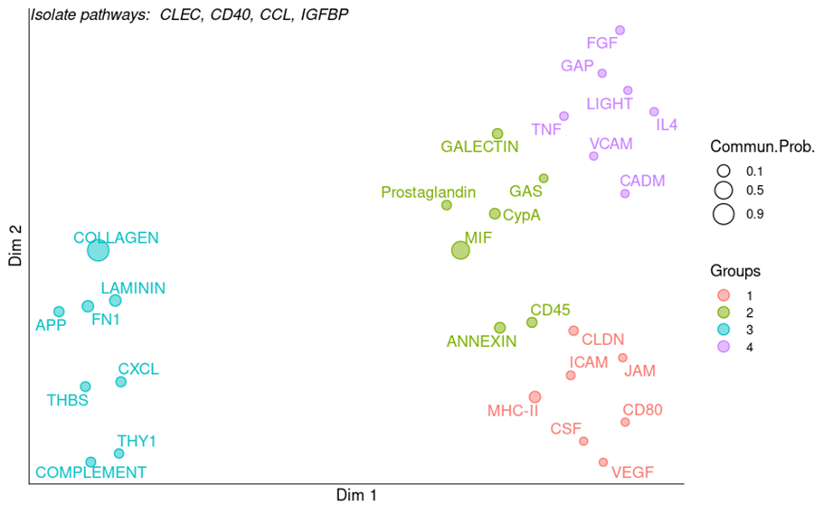

```
cellchat <- computeNetSimilarity(cellchat, type = "structural")
cellchat <- netEmbedding(cellchat, type = "structural")
netVisual_embedding(cellchat, type = "structural", label.size = 3.5)
```
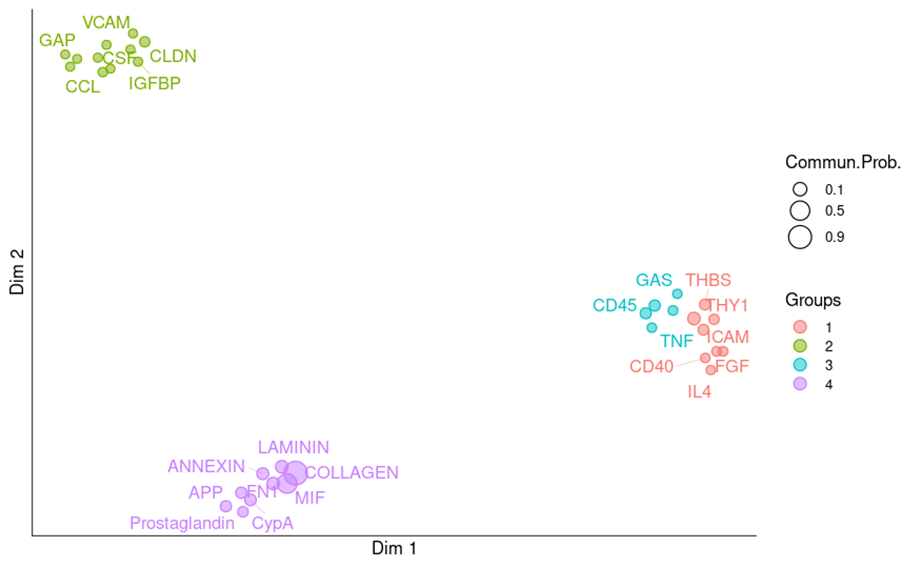

Para observar los grupos de forma individual:
```
netVisual_embeddingZoomIn(cellchat, type = "structural", nCol = 2)
```
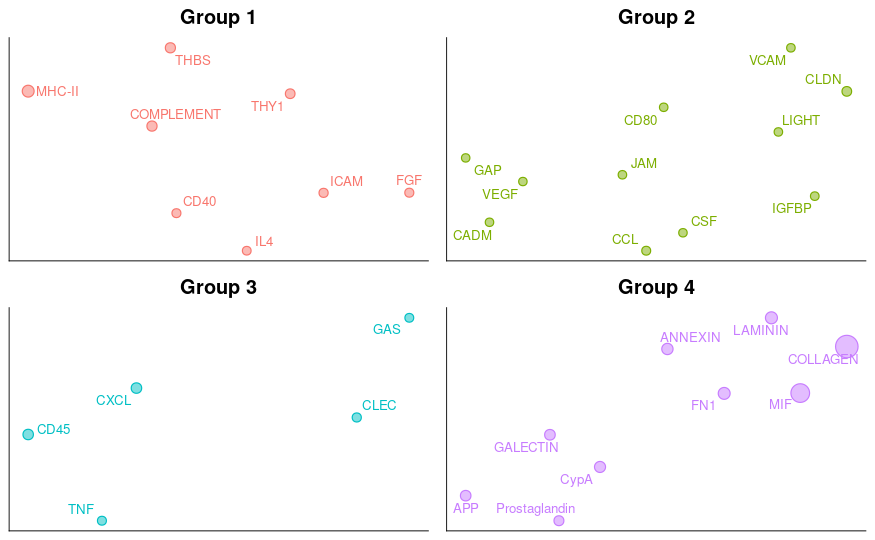

## 📦 Parte 6. Almanecar el objeto CellChat

Finalmente hay que guardar el objeto de análisis.

La función `saveRDS` guarda el objeto `CellChat` en un archivo con formato `.rds`. Este archivo contiene todo el estado del análisis. Es decir, no necesitas volver a correr todo el flujo, sino que puedes retomarlo en cualquier momento.

```
saveRDS(cellchat, file = "cellchat_humanSkin_LS.rds")
```

Para volver a cargarlo después, usarías:
```
cellchat <- readRDS("cellchat_humanSkin_LS.rds"
```

## 💡 Conclusión
CellChat es una poderosa herramienta para inferir y analizar la comunicación entre células a partir de datos de scRNA-seq. Integra la expresión de ligandos y receptores con información previa para identificar interacciones que realmente significativas. Con diferentes métodos de visualización y análisis, puedes explorar estas interacciones a nivel de redes, vías de señalización y pares específicos. 

Una vez, ya recorridas todas las etapas del análisis, es el momento de ponerlo en práctica con tus propios datos.

## 📖 Bibliografía

*Jin, S. (2022). Inference and analysis of cell-cell communication using CellChat. https://htmlpreview.github.io/?https://github.com/sqjin/CellChat/blob/master/tutorial/CellChat-vignette.html#part-iii-visualization-of-cell-cell-communication-network*