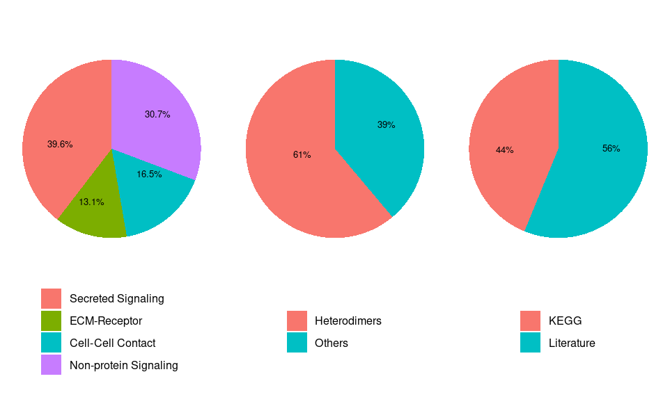

# 💻 Análisis de comunicación celular con CellChat en R

En este tutorial aplicaremos **CellChat** paso a paso para analizar la comunicación célula-célula a partir de datos de scRNA-seq, siguiendo un flujo de trabajo completo en **R**. Aquí trabajaremos directamente con las funciones de la herramienta para **construir e interpretar redes de comunicación intercelular**.

Este tutorial está basado en el material original desarrollado por los autores de CellChat y disponible en su [**repositorio oficial de GitHub**](https://github.com/sqjin/CellChat
). Nuestro objetivo no es reemplazarlo, sino **adaptarlo, traducirlo y explicarlo** de una manera más accesible. Buscamos que comprendas **qué está pasando en cada etapa del análisis**, para que después puedas poner en práctica estos conocimientos en tus propios proyectos y no solo reproducir un flujo de trabajo.

## 🔧 Antes de empezar
Antes de comenzar con el análisis en CellChat, es importante contar con algunos requisitos básicos para asegurar que el flujo de trabajo funcione correctamente.

1. Disponer de R y un entorno de trabajo como RStudio.
2. Contar con conocimientos básicos de R y análisis de scRNA-seq.
3. Se requiere un objeto de scRNA-seq previamente procesado. 

>Es vital tener la anotación de tipos celulares, puesto que CellChat utiliza estas etiquetas para inferir la comunicación entre grupos celulares.

## ⚙️ Parte 0. Instalación de CellChat
Para comenzar, es primordial instalar CellChat y algunas dependencias en R. Dado que CellChat no siempre está disponible directamente en CRAN (*Comprehensive R Archive Network*, ecosistema central de R que alberga decenas de miles de paquetes), se instala desde GitHub.

Primero, asegúrate de tener instalado el paquete devtools (o remotes), que permite instalar paquetes desde GitHub:
```
install.packages("devtools")
library(devtools)
```
Luego, puedes instalar CellChat con el siguiente comando:
```
devtools::install_github("jinworks/CellChat")
```
Durante la instalación, es posible que se instalen automáticamente varias dependencias, por lo que es posible que tarde un rato.

Si ocurre algún error, verifica que tengas actualizadas tus versiones de R y de los paquetes requeridos.

### 0.1  Cargar librerías
Una vez instalado, carga CellChat junto con otros paquetes necesarios:

 - `patchwork`: se emplea para combinar gráficos ggplot en una sola figura.
 - `Cellchat`: permite usar todas sus funciones para explorar la comunicación celular en datos de scRNA-seq.
 - `stringsAsFactors = FALSE`: Evitar que texto se convierta automáticamente en factor.

```
library(CellChat)
library(patchwork)
options(stringsAsFactors = FALSE)
```
## 📂 Parte 1. Input y preparación de los datos

Para este tutorial utilizaremos un conjunto de datos de scRNA-seq que ya ha sido procesado y anotado. Este *dataset* combina información sobre piel humana en 2 condiciones biológicas: LS (piel lesionada) y NL (piel normal).

En el tutorial original, estos datos se proporcionan como un objeto Seurat llamado `data_humanSkin`, el cual contiene la matriz de expresión génica y la anotación de tipos celulares, que son los 2 archivos que Cellchat necesita para trabajar.

### 1.1 Cargar los datos 

Comenzamos cargando el objeto `data_humanSkin`en R. Para ello:

1. Descarga el archivo [data_humanSkin_CellChat.rda](https://ndownloader.figshare.com/files/25950872).
2. Ve al panel **Files**.

3. Haz clic en **Upload**.

4. Selecciona el archivo previamente descargado y haz clic en **OK**.

5. Cuando lo encuentres en el panel **Files**, haz clic en el **archivo**.
6. Luego te aparecerá la siguiente ventana, haz clic en **Yes**.


Otra opción es utilizar la ruta completa de acceso al archivo:

```
load("/ruta/completa/a/data_humanSkin_CellChat.rda")
```
📤 **Salida esperada:** El objeto `data_humanSkin` se encuentra disponible en el entorno de trabajo. El cual incluye: 
- Una matriz de expresión génica (`data`).
- Un *data frame* con los metadatos (`meta`).


#### 1.1.1 Extraer la matriz de expresión y los metadatos

Aquí se separan los dos componentes principales:
- `data.input`: matriz de expresión.
- `meta`: información de cada célula (tipo celular, condición, etc.)

```
data.input = data_humanSkin$data
meta = data_humanSkin$meta
```

📤 **Salida esperada:**: dos objetos listos para manipulación.

- data.input

- meta


#### 1.1.2 Seleccionar las células de interés

En este paso se filtran las células que pertenecen a la condición "LS" (en este caso, enfermedad).
```
cell.use = rownames(meta)[meta$condition == "LS"]
```
📤 **Salida esperada:** En el entorno de trabajo, en la sección *Values*, se encuentra `cell.use`, que consiste en un vector con los nombres (IDs) de las células seleccionadas.


#### 1.1.3 Filtrar la matriz de expresión

Se conservan únicamente las columnas (células) que cumplen la condición seleccionada.

```
data.input = data.input[, cell.use]
```
📤 **Salida esperada:** Matriz de expresión reducida (solo células LS).

#### 1.1.4 Filtrar los metadatos

Se ajusta el data frame de metadatos para que coincida con las células filtradas.

```
meta = meta[cell.use, ]
```
📤 **Salida esperada:** `meta` contiene solo la información de las células seleccionadas.

#### 1.1.5 Verificar los tipos celulares

Este comando permite visualizar los tipos celulares presentes en los datos.

```
unique(meta$labels)
```
📤 **Salida esperada:** Un vector que contiene las etiquetas únicas encontradas.

Se identificaron 12 etiquetas posibles (desde Inflam. FIB hasta NKT). Este dataset contiene diversos tipos celulares, principalmente:
- **Fibroblastos (FIB):** Inflamatorios, FBN1+, APOE+, COL11A1+.
- **Células Dendríticas (DC/cDC):** cDC1, cDC2, Inflam. DC.
- **Células T (TC):** CD40LG+, Inflam. TC, TC general.
- **Otros:** LC (Langerhans o Linfáticas) y NKT (células Natural Killer T).


### 1.2 Crear el objeto CellChat
Una vez cargados los datos, el siguiente paso es convertirlos en un **objeto CellChat**, que será la estructura donde se almacenará todo el análisis.
```
cellchat <- createCellChat(object = data.input, meta = meta, group.by = "labels")
```
- `object = data.input` es el objeto Seurat.
- `group.by = "labels` es la columna que contiene los tipos celulares.

📤 **Salida esperada:**: Crea un objeto llamado `Cellchat` que contiene los datos de expresión organizados por grupo celular y los metadatos, por ahora.


### 1.3 Añadir la base de datos

Recordemos que CellChat usa una base de datos llamada **CellChatDB**, que contiene los pares ligando–receptor conocidos. El algoritmo usa la matriz de expresión para detectar qué células podrían comunicarse usando esos pares.

Para ello, se selecciona la base de datos, en este escenario de humano, con las interacciones ligando-receptor. Si el dataset fuera de ratón usarías: `CellChatDB.mouse`
```
CellChatDB <- CellChatDB.human
```
📤 **Salida esperada:**: Ahora el objeto `CellChat`contiene una inmesa lista de ligandos, receptores, complejos y cofactores.

Puedes verificarlo con:
```
showDatabaseCategory(CellChatDB)
```
📤 **Salida esperada:** Un resumen estadístico que muestra cómo está compuesta CellChatDB.

El primer gráfico muestra cómo ocurre la señalización celular. La base de datos incluye 4 tipos principales de comunicación: 
 1. **Secreted signaling:** Señales que una célula libera al espacio extracelular.
 2. **ECM-Receptor:** Interacciones con la matriz extracelular.
 3. **Cell-cell contact:** Señales que requieren contacto directo entre células.
 4. **Non-protein signaling:** Interacciones que no usan proteínas como ligando principal.

 El segundo gráfico muestra el tipo de complejo molecular, es decir, cómo están formados los receptores o ligandos. Un heterodímero es un receptor formado por dos proteínas distintas
 
 El tercer gráfico muestra la fuente de evidencia. Esto demuestra de dónde provienen las interacciones de la base de datos. Ya sea de literatura científica o KEGG que es una base de datos de rutas biológicas.



Para explorar detalladamente la estructura interna de la base de datos:
```
dplyr::glimpse(CellChatDB$interaction)
```
📤 **Salida esperada:** Una vista previa exhaustiva que confirma que estás trabajando con un catálogo muy robusto de 3,233 interacciones (filas) y 28 variables (columnas) que describen cada evento de comunicación.

Algunas de las columnas más importantes son:
- `interaction_name`: El identificador técnico de la pareja (ej. TGFB1_TGFBR1_TGFBR2). 
> CellChat agrupa complejos de receptores con un guion bajo.
- `pathway_name`: Agrupa las interacciones en vías biológicas (ej. todas las variantes de TGF-beta se agrupan en la vía TGFb). 
- `ligand y receptor:` Quién envía la señal y quién la recibe.
- `annotation:` Clasifica la interacción en las categorías mencionadas anteriormente.
- `evidence:` Es el respaldo científico (códigos de KEGG o IDs de PubMed) que garantiza que esa interacción está probada y no es una predicción al azar.
- Columnas de localización (`location`, `transmembrane`): Indican si el ligando es secretado al espacio extracelular o si el receptor está anclado a la membrana, lo cual es importante para la lógica biológica del modelo.


Puedes crear un subconjunto de CellChatDB para filtrar si hay algún el tipo de señalización en específico que desees explorar.
```
CellChatDB.use <- subsetDB(CellChatDB, search = "Secreted Signaling")
```

O puedes utilizar todas las interacciones posibles.
```
CellChatDB.use <- CellChatDB
```
Para guardar la base en el objeto. Esto le dice al objeto qué base de datos usar para detectar la comunicación celular.
```
cellchat@DB <- CellChatDB.use
```

### 1.3 Preprocesamiento: Filtrar genes relevantes

Ahora vamos a preparar los datos antes de calcular la comunicación entre células. Básicamente, CellChat intenta identificar qué ligandos y receptores están activos en cada tipo celular. Esto reduce el dataset a solo genes que participan en señalización celular. Elimina genes como *housekeeping* y metabólicos y conserva genes como ligandos, receptores y cofactores, lo cual acelera el análisis.

> Este paso es obligatorio, incluso si usas toda la base de datos.

```
cellchat <- subsetData(cellchat)
```
📤 **Salida esperada:**: Internamente disminuye el número de genes analizados y se optimiza el rendimiento.

Analizar miles de células y calcular todas las posibles interacciones ligando-receptor (como las 3,233 que vimos previamente) requiere mucho esfuerzo computacional.

Al emplear:
```
future::plan("multiprocess", workers = 4)
```
Habilitas el procesamiento en paralelo en tu sesión de R. Es una forma de decirle a tu computadora: "No uses un solo núcleo de mi procesador; usa varios al mismo tiempo para terminar más rápido". Ej. R divide 10,000 células en 4 grupos de 2,500 y procesa cada grupo en un núcleo distinto al mismo tiempo. Esto puede reducir el tiempo de espera casi a la cuarta parte.

Mediante este comando, Cellchat busca genes de señalización que estén sobreexpresados en cada tipo celular.
```
cellchat <- identifyOverExpressedGenes(cellchat)
```

Para luego detectar genes ligando/receptor activos y entonces considerar una posible comunicación celular.
```
cellchat <- identifyOverExpressedInteractions(cellchat)
```
📤 **Salida esperada:** CellChat encontró 1645 pares ligando–receptor relevantes.


### Proyección a red PPI (opcional):
 Esto usa una red de interacciones proteína–proteína: PPI. Sirve para corregir el problema de *dropout* en single-cell RNA-seq. 

**Dropout** significa que un gen aparece con expresión 0 aunque sí esté activo. Esto pasa mucho con genes de señalización. La proyección usa difusión en la red proteica para suavizar la expresión.

```
cellchat <- projectData(cellchat, PPI.human)
```

**¿Debes usar projectData()?**

Depende.

- Recomendable si tienes poca profundidad de secuenciación o muchos genes salen como 0.
- No siempre necesario si tus datos están bien normalizados o tienes buena cobertura.

### Evaluación de calidad
 Para revisar que no haya grupos con muy pocas células (ej. < 10) o niveles vacíos, el siguiente comando te muestra cuántas células tienes en cada tipo celular.
```
table(cellchat@idents)
```
📤 **Salida esperada:** Cada número es el tamaño de cada grupo celular.

CellChat usa estos tamaños para normalizar interacciones.

No es lo mismo 1200 fibroblastos enviando señales vs 67 células LC. Los grupos grandes tienden a generar más interacciones.


## 🗪 Parte 2. Inferencia de la comunicación celular
El objetivo de esta sección es transformar los datos de expresión génica en una representación de cómo se relacionan las células entre sí. Para ello, **calcula una probablidad de interacción para cada par ligando-receptor** entre los distintos grupos celulares.

**¿Cómo calcula esa probabilidad?** Utiliza la expresión de los genes (qué tanto se expresa el ligando en un grupo celular y el receptor en otro). Así como CellChatDB que indica qué ligandos interactúan con cuáles receptores.

El modelo matemático que implementa es la **Ley de acción de masas**, en términos sencillos significa que la probabilidad de comunicación aumenta cuando tanto el ligando como el receptor están altamente expresados. Después, CellChat aplica un *permutation test* (una prueba estadística basada en permutaciones) para evaluar si la interacción observada es significativa o podría explicarse por azar. Solo se conservan interacciones significativas.

Otro punto importante es **cómo se calcula la expresión promedio de los genes en cada grupo celular**, ya que esto afecta directamente a cuántas interacciones se detectan. Por defecto, CellChat utiliza un método llamado *trimean*, que es una forma robusta de promedio menos sensible a valores extremos. Este método tiende a ser más estricto, produciendo menos interacciones, pero con mayor confiabilidad. De hecho, si menos del 25% de las células en un grupo expresan un gen, el *trimean* lo considera prácticamente como no expresado, lo que reduce la detección de señales débiles o provenientes de poblaciones pequeñas.

Sin embargo, existen métodos alternativos, como el *truncated mean*, donde solo se eliminan los valores más extremos (por ejemplo, el 10%). Este enfoque es más permisivo y puede detectar más interacciones, incluyendo señales más sútiles. Además, CellChat proporciona funciones como `computeAveExpr` para explorar directamente la expresión promedio de genes específicos de interés.

Por otro lado, cuando se analizan datos de células individuales no separadas previamente (*unsorted*), CellChat también puede considerar el tamaño de cada población celular. Esto se basa en la idea de que poblaciones más abundantes pueden generar señales colectivamente más fuertes que poblaciones raras. Al activar esta opción `(population.size = TRUE)`, el modelo ajusta las probabilidades de interacción tomando en cuenta la proporción de células en cada grupo, lo cual puede hacer el análisis más realista, aunque también puede disminuir la visibilidad de interacciones provenientes de poblaciones pequeñas.

### 2.1 Cálculo de la probabilidad de comunicación

CellChat calcula la probabilidad de comunicación entre todos los grupos celulares usando la función `computeCommunProb`. Esto significa que, para cada par de tipos celulares, el programa evalúa qué tan probable es que exista señalización a través de todos los pares ligando-receptor conocidos.

Usa por defecto el método `triMean` para resumir la expresión génica por grupo.

```
cellchat <- computeCommunProb(cellchat)
```

📤 **Salida esperada:**: El resultado de esta función se guarda en el interior del objeto `CellChat`. Dentro de `object@options$parameter` se almacenan las probabilidades de comunicación y los parámetros usados en el cálculo.

>Nota: Si hay vías de señalización conocidas que esperas ver pero no aparecen, puedes cambiar el método de promedio a uno menos estricto, como *truncated mean*.

### 2.1.2 Filtrado de interacciones poco confiables

Después se aplica un paso de control de calidad con la función `filterCommunication` al eliminar interacciones que involucran grupos celulares con pocas células.
```
cellchat <- filterCommunication(cellchat, min.cells = 10)
```
### 2.2 Extraer la red de comunicación celular inferida

La función `subsetCommunication` se utiliza para extraer la red de comunicación celular en forma de tabla (*data frame*). Hasta ahora, toda la información está guardada dentro del objeto `CellChat`, pero no es fácil de ver directamente. Esta función hace posible convertir esas interacciones en algo más manejable, donde puedes ver claramente: qué célula envía la señal, cuál la recibe, qué ligando-receptor está involucrado y qué tan fuerte es la interacción.

Al usar:

```
df.net <- subsetCommunication(cellchat)
```
obtienes todas las interacciones inferidas a nivel de ligando-receptor. Es decir, cada fila representa una interacción específica. Si en lugar de eso usas `slot.name = "netP"`, entonces accedes a las interacciones a nivel de vías de señalización completas, no de pares individuales. Esto es útil porque muchas veces lo que te interesa no es un gen en particular, sino rutas.

También puedes filtrar la información según lo que te interese. 

Si especificas `sources.use` y `targets.use`: 
```
df.net <- subsetCommunication(cellchat, sources.use = c(1,2), targets.use = c(4,5))
```
Estás seleccionando qué tipos celulares envían y cuáles reciben señales, lo cual es útil si quieres enfocarte en interacciones específicas.

De forma similar, puedes filtrar por tipo de señalización usando el argumento `signaling`:
```
df.net <- subsetCommunication(cellchat, signaling = c("WNT", "TGFb"))
```
Lo que te permite quedarte solo con interacciones asociadas a vías específicas que te llamen la atención.

### 2.3 Inferir la comunicación celular a nivel de vía de señalización

Mediante la función `computeCommunProbPathway`, CellChat pasa de interacciones individuales a una visión más general. Lo que hace es agrupar todas las interacciones ligando-receptor que pertenecen a una misma vía de señalización y calcular una probabilidad global para esa vía. Es decir, en lugar de ver interacciones aisladas, puedes ver qué tan activa está una ruta completa de comunicación entre células.
```
cellchat <- computeCommunProbPathway(cellchat)
```
Es esencial entender cómo se organiza esta información dentro del objeto `CellChat`. Las interacciones a nivel de ligando-receptor se guardan en `net`, mientras que las interacciones a nivel de vías de señalización se guardan en `netP`.

### 2.4 Calcular la red de comunicación agregada entre celdas

Después de haber calculado todas las interacciones célula-célula, la función `aggregateNet` se utiliza para resumir esa información en una red más simple. En lugar de ver miles de pares ligando-receptor individuales, aquí CellChat agrupa todo y calcula, para cada par de tipos celulares, dos cosas principales:

1. El número de interacciones que existen entre ellos, y
2. La fuerza total de comunicación (sumando las probabilidades de todas las interacciones).

Esto es muy útil porque te permite responder preguntas más globales, como: ¿qué tipo celular es el que más se comunica? o ¿qué interacción entre células es más fuerte en general? Además, si te interesa solo un subconjunto de células, puedes usar `sources.use` y `targets.use` para enfocarte en interacciones específicas.

## Parte 3. Visualización y análisis